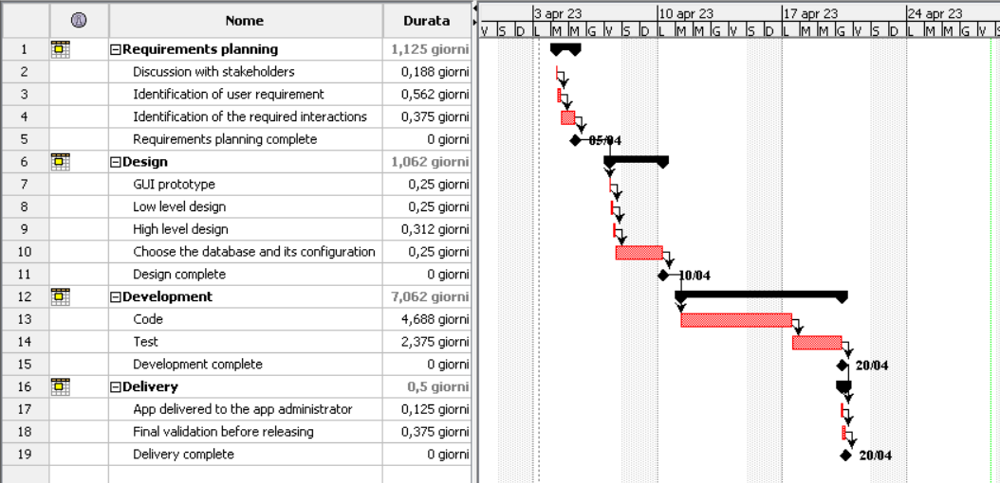

# Project Estimation - CURRENT
Date: 04/21/2023

Version: v1-just testing

# Estimation approach
Consider the EZWallet  project in CURRENT version (as received by the teachers), assume that you are going to develop the project INDEPENDENT of the deadlines of the course
# Estimate by size

### 
|             | Estimate                        |             
| ----------- | ------------------------------- |  
| NC =  Estimated number of modules to be developed   |             12                |             
|  A = Estimated average size per class, in LOC    |71   |                            | 
| S = Estimated size of project, in LOC (= NC * A) | 852  |
| E = Estimated effort, in person hours (here use productivity 10 LOC per person hour)  |        86                |   
| C = Estimated cost, in euro (here use 1 person hour cost = 30 euro) | 2580 | 
| Estimated calendar time, in calendar weeks (Assume team of 4 people, 8 hours per day, 5 days per week ) |        2 days   and 3 hours         |               

# Estimate by product decomposition
### 
|         component name    | Estimated effort (person hours)   |             
| ----------- | ------------------------------- | 
| Requirement document    | 42 |
| GUI prototype | 12 |
| design document | 30 |
| code | 129 |
| unit tests | 18 |
| api tests | 54 |
| management documents  | 24 |

# Estimate by activity decomposition
### 

|         Activity name    | Estimated effort (person hours)   |             
| ----------- | ------------------------------- | 
| Discussion with stakeholders| 6 |
| Identification of user requirements | 18 |
| Identification  of performance | 6 |
| Identification of the required interactions| 12 |
| GUI prototype | 12 |
| Low level design | 15 |
| High level design | 15 |
| Choose the database and its configuration | 12 |
| Code | 150 |
| Test  | 75 |
| App delivered to the App administrator | 6 |
| Final validation before releasing | 18 |

### Gantt chart

# Summary

Report here the results of the three estimation approaches. The  estimates may differ. Discuss here the possible reasons for the difference

|             | Estimated effort                        |   Estimated duration |          
| ----------- | ------------------------------- | ---------------|
| estimate by size |  86 | 2 days and 3 hours|
| estimate by product decomposition | 309 |  2 weeks | 
| estimate by activity decomposition | 345 | 2 weeks and 2 days  |

