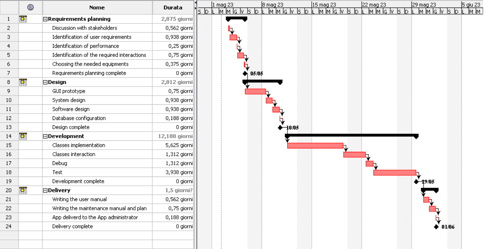

# Project Estimation - FUTURE
Date: 23/04/2023

Version: v2

# Estimation approach
Consider the EZWallet  project in FUTURE version (as proposed by the team), assume that you are going to develop the project INDEPENDENT of the deadlines of the course
# Estimate by size 
### 
|             | Estimate                        |             
| ----------- | ------------------------------- |  
| NC =  Estimated number of modules to be developed   |             38                |             
|  A = Estimated average size per class, in LOC       |           71                 | 
| S = Estimated size of project, in LOC (= NC * A) | 2698  |
| E = Estimated effort, in person hours (here use productivity 10 LOC per person hour)  |        270             |   
| C = Estimated cost, in euro (here use 1 person hour cost = 30 euro) | 6300 | 
| Estimated calendar time, in calendar weeks (Assume team of 4 people, 8 hours per day, 5 days per week ) |        1 week 3 days and 4 hours         |               

# Estimate by product decomposition
### 
|         component name    | Estimated effort (person hours)   |             
| ----------- | ------------------------------- | 
| requirement document    | 96 |
| GUI prototype | 24 |
| design document | 60 |
| code | 270 |
| unit tests | 36 |
| api tests | 84 |
| management documents  | 42 |

# Estimate by activity decomposition
### 
|         Activity name    | Estimated effort (person hours)   |             
| ----------- | ------------------------------- | 
| Discussion with stakeholders| 18 |
| Identification of user requirements | 30 |
| Identification  of performance | 8 |
| Identification of the required interactions| 24 |
| Choosing the needed equipments | 12 |
| GUI prototype | 24 | 
| System design | 30   |
| Software design | 30 |
| Database configuration | 6 |
| Classes implementation | 180 |
| Classes interaction | 42 |
| Debug | 42 |
| Test  | 126 |
| Writing the user manual | 18 |
| Writing the maintenance manual and the plan | 24 |
| App delivered to the App administrator | 6 |

### Gantt Char

# Summary

Report here the results of the three estimation approaches. The  estimates may differ. Discuss here the possible reasons for the difference

|             | Estimated effort                        |   Estimated duration |          
| ----------- | ------------------------------- | ---------------|
| estimate by size | 270 | 1 week 3 days and 4 hours |
| estimate by product decomposition | 612 | 3 weeks and 4 days and 1 hour |
| estimate by activity decomposition | 624 | 3 weeks 4 days and 4 hours |

