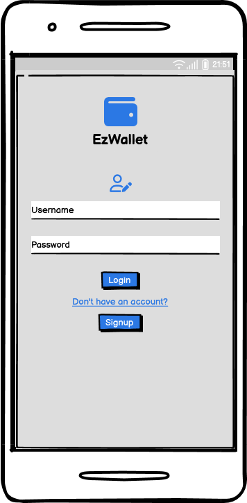
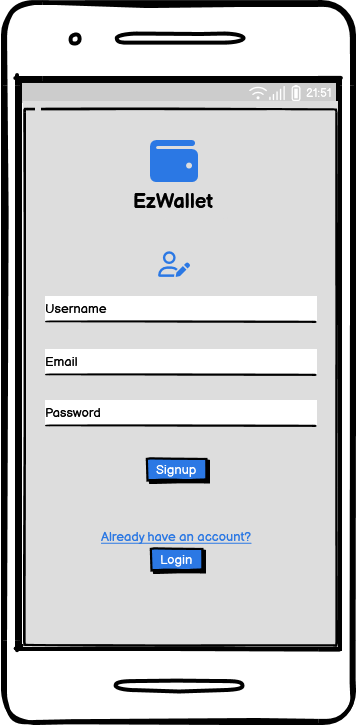
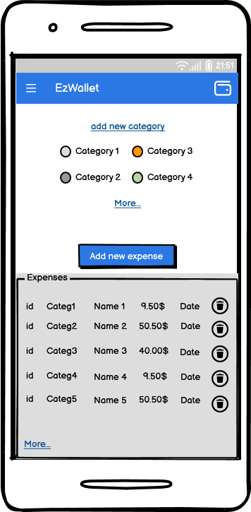

# Graphical User Interface Prototype  - CURRENT

Authors: 

Date: 28/04/2023

Version: 1
# Login

# Login failed

# Registration 

# Registration failed

# Home Page 

# Functionalies (on a sidebar)

# Get all transactions 

# Add transaction 

# Get transaction label 

# Delete transaction 

# Get users 

# Get by username 

# Get all categories 

# Add new category 

