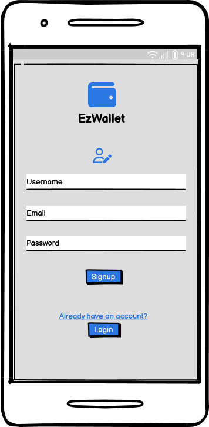
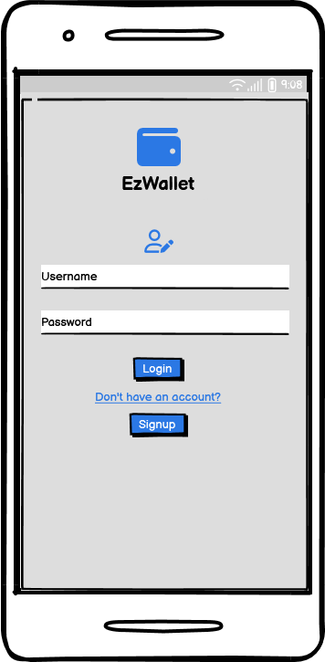
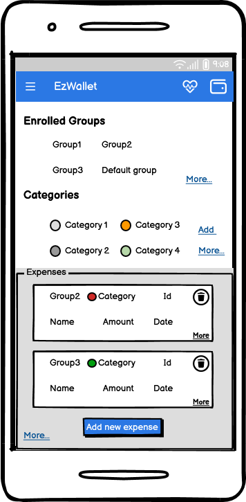
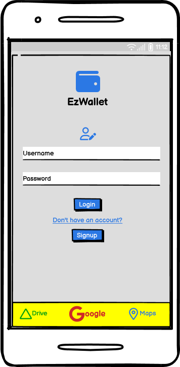

# Graphical User Interface Prototype  - FUTURE

Authors:

Date:

Version:
# Registration

 # Registration failed

# Login

# Login failed

# Functionalies (on a sidebar)

# Home Page 

# Get all categories 

# Add new category 

# Add new category but the category already exists

# Get all transactios 

# Modify transaction

# Add transaction 

# Add transaction but the transaction already exists

# Get transactions specific functionality

# Get transactions of a user in a group

# Delete transaction

# Get the list of all group enrolled

# Creat a new groupe

# Get all users of an group

# Get group details

# Leave a group

# Leave a group with only one user 

# Remove a user from a group 

# User correctly removed from a group

# Try to delete a group with many user

# Delete a roup with only a member

# Get user's profile

# Settle the balance with a user of a group

# Accept a group invitation 

# Reject a group invitation 

# Filter possibilities

# Filter by category

# Filter by period of time

# Filter by threhold

# Notification management

# Show stats of a group

# Show stats of a user in a group

# Transaction position history

# Advertisement on the app

# Admin interface

# Admin login

# Admin get users

# Admin user detail 

# Manage advertisement

