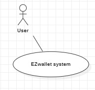
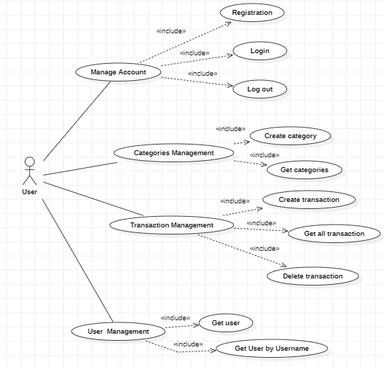
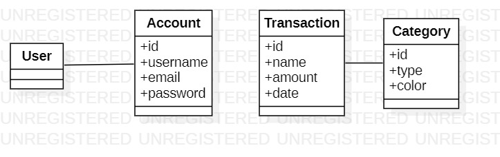
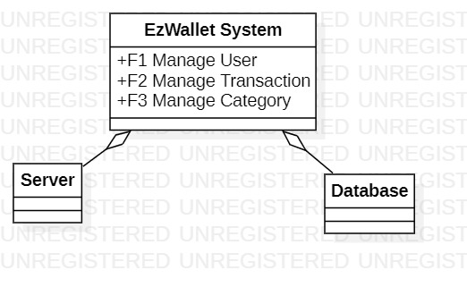
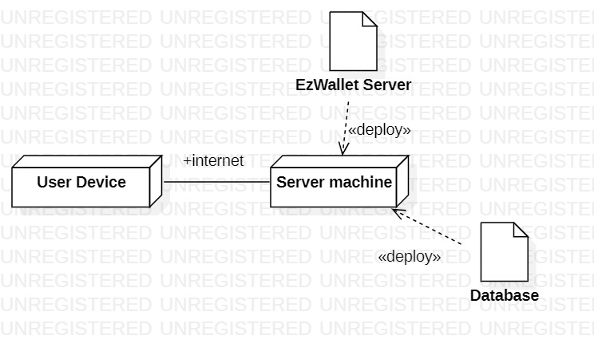

# Requirements Document - current EZWallet

Date: 

Version: V1 - description of EZWallet in CURRENT form (as received by teachers)

 
| Version number | Change |
| ----------------- |:-----------|
| 1.1 | All the detail implemented |
| 1.2 | Correction of problems and errors|
|  1.3 | Last revsion | 

# Contents

- [Informal description](#informal-description)
- [Stakeholders](#stakeholders)
- [Context Diagram and interfaces](#context-diagram-and-interfaces)
	+ [Context Diagram](#context-diagram)
	+ [Interfaces](#interfaces) 
	
- [Stories and personas](#stories-and-personas)
- [Functional and non functional requirements](#functional-and-non-functional-requirements)
	+ [Functional Requirements](#functional-requirements)
	+ [Non functional requirements](#non-functional-requirements)
- [Use case diagram and use cases](#use-case-diagram-and-use-cases)
	+ [Use case diagram](#use-case-diagram)
	+ [Use cases](#use-cases)
    	+ [Relevant scenarios](#relevant-scenarios)
- [Glossary](#glossary)
- [System design](#system-design)
- [Deployment diagram](#deployment-diagram)

# Informal description
EZWallet (read EaSy Wallet) is a software application designed to help individuals and families keep track of their expenses. Users can enter and categorize their expenses, allowing them to quickly see where their money is going. EZWallet is a powerful tool for those looking to take control of their finances and make informed decisions about their spending. The application is based on a open source project, the service is offered for free and there is no found for the deployment .

# Stakeholders

| Stakeholder name  | Description | 
| ----------------- |:-----------:|
|   User    | The User is the person who uses the app as an individual or part of a family  | 
| Admin | The user is in charge of user menagement |
| Competitors | Many different apps on the stores with the same functions. |
| Development Team | Who is in role of developing the app.|
| DB Administrator |  The person who takes control of the databases of the app.|
| UI & UX Designers | The team that design the app. |

# Context Diagram and interfaces

## Context Diagram

 

## Interfaces
| Actor | Logical Interface | Physical Interface  |
| ------------- |:-------------:| -----:|
| User       | GUI | Smartphone |

# Stories and personas
**Persona 1**: male, young, student, low income, not married 

**Story**: Studies far from his hometown, being on a budget. He needs to keep track of all of his expenses when he's not home, and has a limit of maximum amount of expenses for the month.

**Persona 2**: female, young, cashier, low income, not married

**Story**: Wants to start saving money for buying a new mobile phone. She needs to start keeping track of her savings and categorize them to understand what kind of categories expenses shouls be cut off.

**Persona 3**: male, middle age, doctor, high income, married with children

**Story**: Is having a newborn child, he wants to be sure to track all of the future new expenses.

**Persona 4**: female, middle age, full stack developer, high income, married with children

**Story**: Is currently in a holiday trip. She wants to keep track of all the money spent during the holiday and organize them.

**Persona 5**: male, young, research scientist, middle income, not married

**Story**: Is about to start his first job after graduation. He's moving to a new town and renting a new apartment. He wants to keep  track of all the new expenses.

# Functional and non functional requirements

## Functional Requirements

| ID        | Description  |
| ------------- |:-------------:| 
|  FR1     | Authentication Management  |
|  FR1.1     | User Registration  |
| FR1.2  | Login |
| FR1.3  | LogOut |
| FR1.4 | Keep the session active until logout | 
| FR2  | Categories management | 
| FR2.1  | Creation of a new category | 
| FR2.2  | Get all categories | 
| FR3  | Transaction Management | 
| FR3.1  | Create transaction | 
| FR3.2  | Get all transactions|
| FR3.3  | Delete transaction with a specific id| 
| FR3.4 | Get the label of the transactions | 
| FR4  | Users Management |
| FR4.1  | Get User | 
| FR4.2 | Get user by Username |

## Non Functional Requirements
| ID        | Type (efficiency, reliability, ..)           | Description  | Refers to |
| ------------- |:-------------:| :-----:| -----:|
|  NFR1     | Usability  |  A technical user should spend around 1 hour to understand all the functionalities | all FR |
|  NFR2     | Efficiency | Response time <500 ms | all FR |
|  NFR3     | Correctness | CRUD properties | all FR |
| NFR4 | Availability | DB and server available at least 23 hours every day. Straordinary technical menagement will be less than 6 hours. | all FR | 
| NFR5 | Maintainability | Bug fix and mulfunction correction and adding new functionalities in less than 8-10 ph.|  FR2,FR3,FR4 |
| NFR6 | Security  | Access and specific action only for authorized user | all FR |

# Use case diagram and use cases

## Use case diagram

### Use case 1, User Registration 
| Actors Involved        | User |
| ------------- |:-------------:| 
|  Precondition     | User is not already registered |
|  Post condition     | User has created a new account |
|  Nominal Scenario     | Email, password and username accepted |
|  Variants     | - |
|  Exceptions     | email already used |

| Scenario 1.1 | Registration successful (Nominal) |
| ------------- |:-------------:| 
|  Precondition     | Belong no account |
|  Post condition     | New account creation |
| Step#        | Description  |
|  1     | User inserts username, email and password |  
|  2     | Email, username and password sent to the Server |
|  3   	 | Server accepts the credential |
|  4 	 | Server sends back acknowledge |
|  5 	 | Registration accepted |
| 6 | A new account is created|

| Scenario 1.2 | Registration failed (Exception) |
| ------------- |:-------------:| 
|  Precondition     | Belong no account |
|  Post condition     | Account not created |
| Step#        | Description  |
|  1     | User inserts username, email and password |  
|  2     | Email, username and password sent to the Server |
|  3   	 | Server doesn't accept the mail, because it is already used |
|  4 	 | Server sends back rejection |
|  5 	 | Registration denied |

### Use case 2, User Login
| Actors Involved        | User |
| ------------- |:-------------:| 
|  Precondition     | User is already registered to the system |
|  Post condition     | Login sucessful notification |
|  Nominal Scenario     | email and password are correct |
|  Variants     | - |
|  Exceptions     | email or password is wrong |

| Scenario 2.1 | Login successful (Nominal)|
| ------------- |:-------------:| 
|  Precondition     | Login not performed |
|  Post condition     | Login success |
| Step#        | Description  |
|  1     | User inserts email and password |  
|  2     | email and password validity controlled by the Server |
|  3   	 | Server accepts email and password |
|  4 	 | Server sends back acknowledge |
|  5 	 | Login accepted |

| Scenario 2.2 | Login failed (Exception)|
| ------------- |:-------------:| 
|  Precondition     | Login not performed |
|  Post condition     | Login not performed |
| Step#        | Description  |
|  1     | User inserts email and password |  
|  2     | Email and password validity controlled by the Server |
|  3   	 | Server rejects email or password |
|  4 	 | Server sends back an error notification |
|  5 	 | Login Failed |

### Use case 3, User Logout
| Actors Involved        | User |
| ------------- |:-------------:| 
|  Precondition     | User is logged in the application |
|  Post condition     | User sees the login page  |
|  Nominal Scenario     | Logout successfully |
|  Variants     | - |
|  Exceptions     | - |

| Scenario 3.1 | Logout operation (Nominal)|
| ------------- |:-------------:| 
|  Precondition     | Already logged  |
|  Post condition     | Logout performed |
| Step#        | Description  |
|  1     | User sends a logout request  |  
|  2     | Logout request accepted by the server |
| 3 | Logout succesful |

### Use case 4, Creation of a new category
| Actors Involved        | User |
| ------------- |:-------------:| 
|  Precondition     | Login successful |
|  Post condition     | A new category is added |
|  Nominal Scenario     | Number of category increased of one component  |
|  Variants     | The category already exists |
|  Exceptions     | - |

| Scenario 4.1 | Creation of a new category (Nominal) |
| ------------- |:-------------:| 
|  Precondition     | Login successful  |
|  Post condition     | New category created |
| Step#        | Description  |
|  1     | User inserts name and color  |  
|  2     | Request sent to the Server |
| 3 | Server acknowledge |
| 4 | Category created |

| Scenario 4.2 | Creation of a category that already exists (Variant) |
| ------------- |:-------------:| 
|  Precondition     | Login successful  |
|  Post condition     | New category created |
| Step#        | Description  |
|  1     | User inserts name and color  |  
|  2     | Request sent to the Server |
| 3 | Server acknowledge |
| 4 | Category created |
| 5 | A category with the same name and color already exists |
| 6 | There are two instances of the same category with different ID |

### Use case 5, Get categories
| Actors Involved        | User |
| ------------- |:-------------:| 
|  Precondition     | User login |
|  Post condition     | The lists of categories is shown |
|  Nominal Scenario     | The list of categories is shown |
|  Variants     | No category exist |
|  Exceptions     | - |

| Scenario 5.1 | Get categories (Nominal) |
| ------------- |:-------------:| 
|  Precondition     | User already logged  |
|  Post condition     | The list of categories is shown |
| Step#        | Description  |
|  1     | User sends get_Categories request  |  
|  2     | Server receives the request |
| 3 | The DB sends back the categories already exist |
| 4 | The user sees the list of categories created | 

### Use case 6, Creation of a new transaction  
| Actors Involved        | User |
| ------------- |:-------------:| 
|  Precondition     | Transaction doesn't exist yet |
|  Post condition     | A new transaction is created |
|  Nominal Scenario     | Creation success |
|  Variants     | - |
|  Exceptions     | - |

| Scenario 6.1 | New transaction created (Nominal) |
| ------------- |:-------------:| 
|  Precondition     | User exists and has a valid account |
|      | User is logged in |					
|  Post condition     | New transaction in list of transactions |
| Step#        | Description  | 
|  1     | User sends a request with the transaction parameters |
|  2     | System saves the new transaction in the DB |
|  3	 | New transaction is in the list |

### Use case 7, Get all transactions
| Actors Involved        | User |
| ------------- |:-------------:| 
|  Precondition     | There are different transaction |
|  Post condition     | Transaction list is shown in detail |
|  Nominal Scenario     | All the transactions retrieved |
|  Variants     | Empty list is shown |
|  Exceptions     | - |

| Scenario 7.1 | Get transactions (Nominal)|
| ------------- |:-------------:| 
|  Precondition     | User exists and has a valid account |
|					| User is logged in |
|  Post condition     | Transactions list shown |
| Step#        | Description  |
|  1     | User send a get_transaction request  |  
|  2     | Server receives request |
|  3   	 | DB sends back the list of transactions |
|  4 	 | List of transactions is shown |

| Scenario 7.2 | No transactions already exist (Variant)|
| ------------- |:-------------:| 
|  Precondition     | User exists and has a valid account |
|					| User is logged in |
|  Post condition     | Transactions list shown |
| Step#        | Description  |
|  1     | User sends a get_transaction request  |  
|  2     | Server receives request |
|  3   	 | DB sends back the list of transactions |
|  4 	 | An empty list is shown |
### Use case 8, Delete transaction 
| Actors Involved        | User |
| ------------- |:-------------:| 
|  Precondition     | List of transaction available |
|  Post condition     | Chosen transaction deleted from the list |
|  Nominal Scenario     | Transaction deleted |
|  Variants     | - |
|  Exceptions     | No transaction available |

| Scenario 8.1 | Delete transaction by id (Nominal)|
| ------------- |:-------------:| 
|  Precondition     | User exists and has a valid account |
|					| User is logged in |
|  Post condition     | Transaction deleted |
| Step#        | Description  |
|  1     | User sends a delete_transaction request with the transaction id |  
|  2     | Server receives request |
|  3   	 | DB deletes the transaction |
|  4 	 | Successful notification is sent back |

### Use case 9, Get users  
| Actors Involved        | User |
| ------------- |:-------------:| 
|  Precondition     | login success  |
|  Post condition     | Search completed |
|  Nominal Scenario     | Users details as outcome |
|  Variants     | - |
|  Exceptions     | - |

| Scenario 9.1 | Get users (Nominal)|
| ------------- |:-------------:| 
|  Precondition     | User exists and has a valid account |
|					| User is logged in |
|  Post condition     | Users list shown |
| Step#        | Description  |
|  1     | User sends a getUsers request  |  
|  2     | Server receives request |
|  3   	 | Server sends back the list of users |
|  4 	 | List of users is shown |

### Use case 10, Get user profile by username  
| Actors Involved        | User |
| ------------- |:-------------:| 
|  Precondition     | login success |
|  Post condition     | Profile found |
|  Nominal Scenario     | User account as outcome |
|  Variants     | - |
|  Exceptions     | - |

| Scenario 10.1 | Get users by username (Nominal)|
| ------------- |:-------------:| 
|  Precondition     | User exists and has a valid account |
|					| User is logged in |
|  Post condition     | Users profile shown |
| Step#        | Description  |
|  1     | User sends a getUserByUsername request  |  
|  2     | Server receives request |
|  3   	 | Server sends back the users profile |
|  4 	 | User profile is shown |

# Glossary

# System Design

# Deployment Diagram 

# Defects
- GatLabels function does not return the category color
- Transactions and categories are general and not tied to the user who created them, but everyone can see everything
- No admin implementation
- GetUsers can be done by users not logged in

