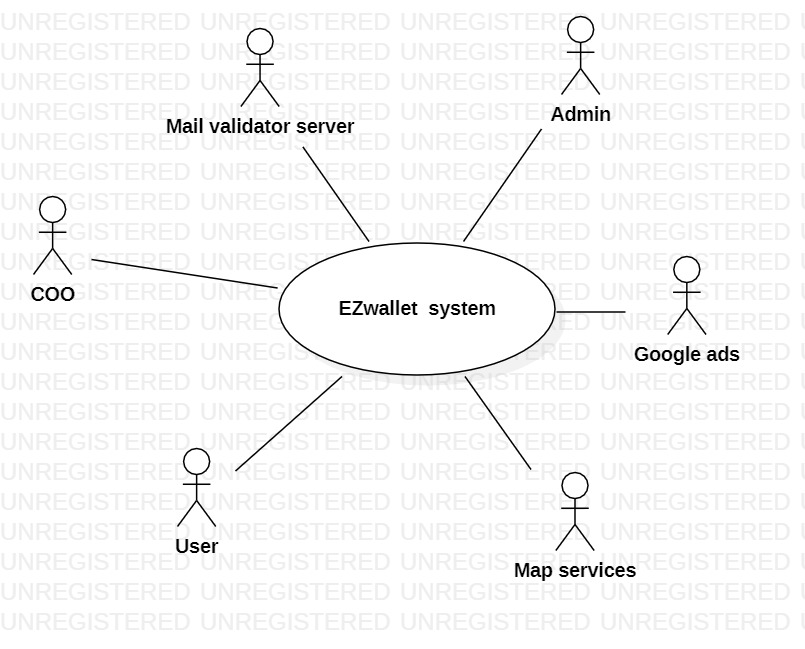
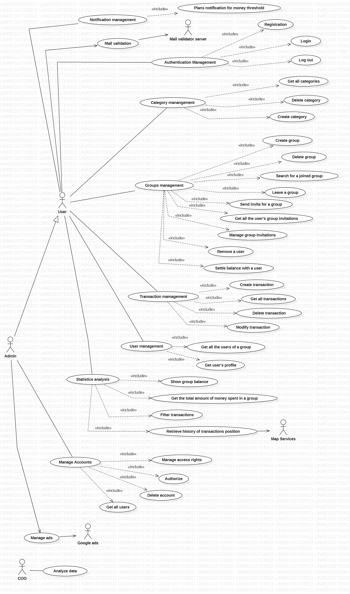
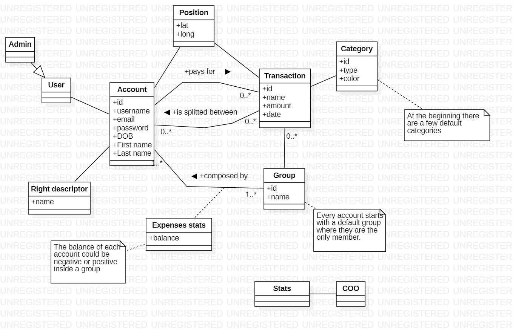
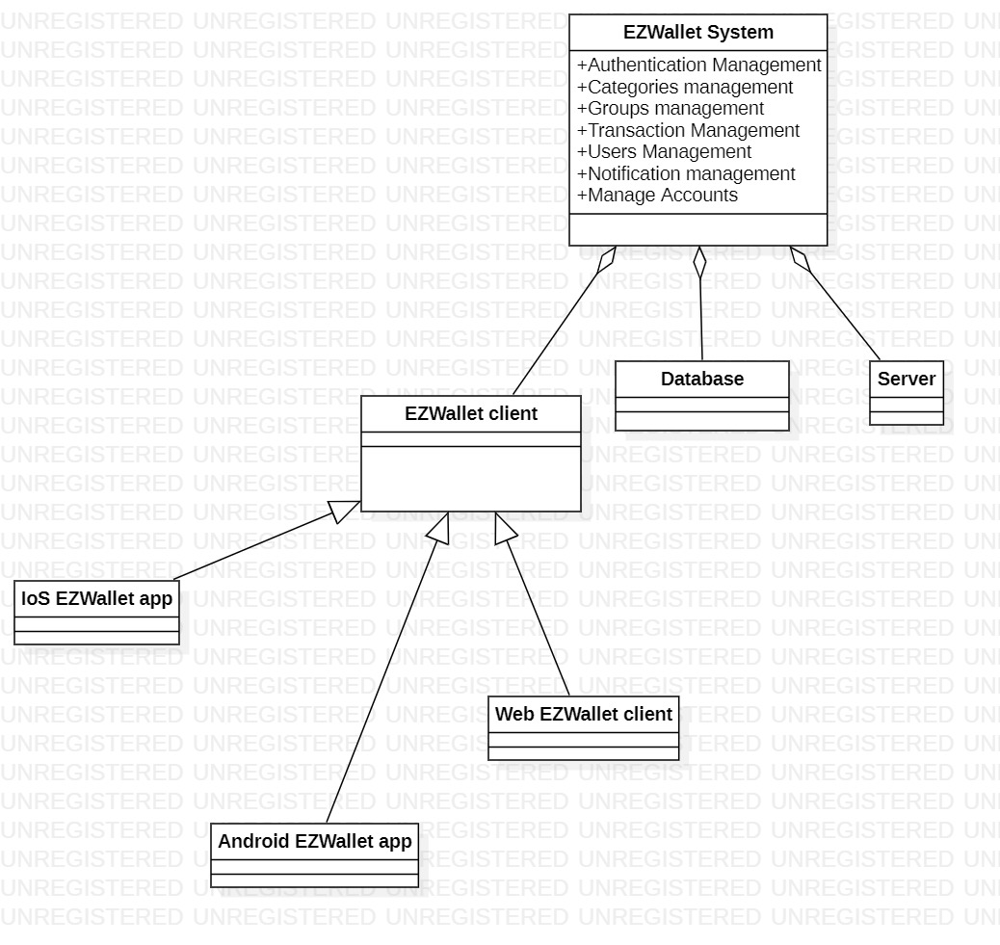
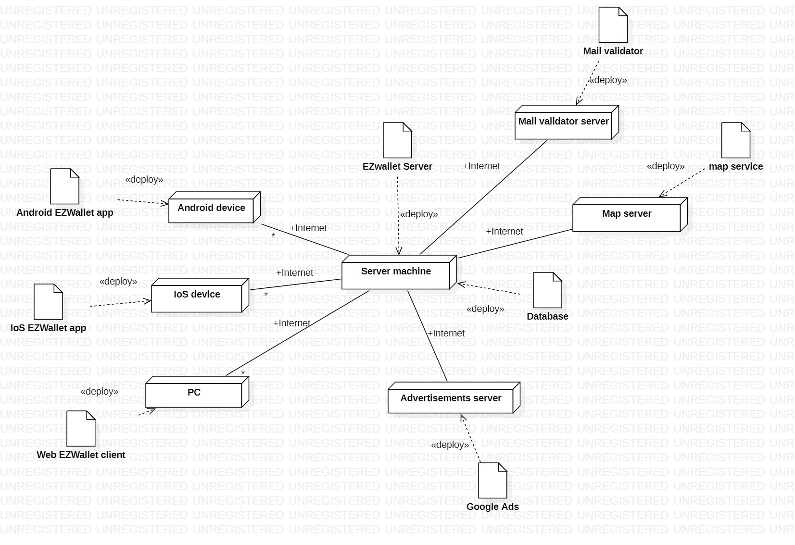

# Requirements Document - future EZWallet

Date: 

Version: V2 - description of EZWallet in FUTURE form (as proposed by the team)

 
| Version number | Change |
| ----------------- |:-----------|
| 2.1 | Google Ads, Map services and Mail verificator added to the stakeholders  | 
| 2.2 | Admin,COO, Google Ads, Map services and Mail verificator added to the context diagram|
| 2.3 | New classes "Group" and "Expenses stats" with related functionalities and new functional requirements. New functionalities for the class "Transactions" |

# Contents

- [Informal description](#informal-description)
- [Stakeholders](#stakeholders)
- [Context Diagram and interfaces](#context-diagram-and-interfaces)
	+ [Context Diagram](#context-diagram)
	+ [Interfaces](#interfaces) 
	
- [Stories and personas](#stories-and-personas)
- [Functional and non functional requirements](#functional-and-non-functional-requirements)
	+ [Functional Requirements](#functional-requirements)
	+ [Non functional requirements](#non-functional-requirements)
- [Use case diagram and use cases](#use-case-diagram-and-use-cases)
	+ [Use case diagram](#use-case-diagram)
	+ [Use cases](#use-cases)
    	+ [Relevant scenarios](#relevant-scenarios)
- [Glossary](#glossary)
- [System design](#system-design)
- [Deployment diagram](#deployment-diagram)

# Informal description
EZWallet (read EaSy Wallet) is a software application designed to help individuals and families keep track of their expenses. Users can enter and categorize their expenses, allowing them to quickly see where their money is going. EZWallet is a powerful tool for those looking to take control of their finances and make informed decisions about their spending. Starting from and ope source project, capitals for the deployment are provided by investors, the application is developed by a team and the service is offered for free but the users must watch ads.This application is used by groups of people which trust each other, where is not necessary a group owner that control the changes (expenses, deletion, slitting)

# Stakeholders

| Stakeholder name  | Description | 
| ----------------- |:-----------:|
|   User    | The User is the person who uses the app as an individual or part of a family  | 
| Admin | The user is in charge of user menagement |
| Competitors | Many different apps on the stores with the same functions. |
| Development Team | Who is in role of developing the app.|
| DB Administrator |  The person who takes control of the databases of the app.|
| UI & UX Designers | The team that design the app. |
| Start app CEO | The one who take decision and invest money |
| COO | Perform analysis on transaction and category |
| Google Ads | An online advertisement platform for the app revenue |
| Map services | An online service to keep track of the position |
| Mail validator Server | A service to verificate the validity of the mail inserted for the registration |

# Context Diagram and interfaces

## Context Diagram

 

## Interfaces

| Actor | Logical Interface | Physical Interface  |
| ------------- |:-------------:| -----:|
| User       | GUI | Smartphone |
| Admin | GUI | Smartphone |
| COO | specific GUI for data analysis | PC |
| Map Services | https://wiki.openstreetmap.org/wiki/API_v0.6 | Internet link |
| Google Ads | https://developers.google.com/google-ads/api/docs/start | Internet link |
| Mail validator Server | https://www.abstractapi.com/api/email-verification-validation-api| Internet link |

# Stories and personas

**Persona 1**: male, young, student, low income, not married  

**Story**: Studies far from his hometown, being on a budget. He needs to keep track of all of his expenses when he's not home, and set a limit of maximum amount of expenses for the month. He shares an apartment with other student roommates, and they usually buy and share household products, so they need a smart and easy way to keep track of the money balances.

**Persona 2**: female, middle age, full stack developer, high income, married with children 

**Story**: Is currently in a holiday trip with some friends. She wants to keep track of all the money spent during the holiday and organize them. Since the flights and most of the places to visit had to be booked online, they decided to divide roles. So since each one of them will have to pay for a different group cateogory expense, they need a reliable way to keep track of all the expenses. 

**Persona 3**: female, young, cashier, low income, not married  

**Story**: Wants to start saving money for buying a new mobile phone. She needs to start keeping track of her savings and categorize them to understand what kind of categories expenses shouls be cut off.

**Persona 4**: male, middle age, doctor, high income, married with children  

**Story**: Is having a newborn child, he wants to be sure to track all of the future new expenses.

**Persona 5**: male, young, research scientist, middle income, not married 

**Story**: Is about to start his first job after graduation. He's moving to a new town and renting a new apartment. He wants to keep  track of all the new expenses.

**Persona 6**: female,young, mother,middle income, married with children  

**Story**: Working mother of two who children, she is responsible for managing her family's finances. She is always looking for ways to save money and stay within her budget to be able to pay for his children needs. 

# Functional and non functional requirements

## Functional Requirements

| ID        | Description  |
| ------------- |:-------------:| 
|  **FR1** | **Authentication Management**  |
|  FR1.1   | User Registration  |
| FR1.2    | Login |
| FR1.3    | LogOut |
| FR1.4    | Keep the session active until logout | 
| **FR2**  | **Categories management** | 
| FR2.1    | Create a category | 
| FR2.2    | Get all categories | 
| FR2.3	   | Delete a category |
| **FR3**| **Groups management**|
| FR3.1    | Create group |
| FR3.2    | Delete group |
| FR3.3    | Search for a joined group |
| FR3.4    | Get all the user's group invitations |
| FR3.5    | Send invite for a group | 
| FR3.5.1  | Share a group link |
| FR3.5.2  | Send in-app invitation |
| FR3.6	   | Manage group invitations |
| FR3.6.1  | Accept a group invitation |
| FR3.6.2  | Reject a group invitation |
| FR3.7    | Remove a user |
| FR3.8    | Leave a group |
|  FR3.9   | Settle balance with a user  |
| **FR4**  | **Transaction Management** | 
| FR4.1    | Create transaction | 
| FR4.2    | Get all transactions |
| FR4.2.1  | Get all transactions in a group |
| FR4.2.1  | Get all the user's transactions inside a group  |
| FR4.3    | Delete transaction | 
| **FR5**  | **Users Management** |
| FR5.1    | Get all the users of a group | 
| FR5.2    | Get user's profile |
| **FR6**  | **Statistics analysis** |
| FR6.1    | Get the total amount of money spent |
| FR6.1.1  | Get the total amount of money spent by the whole group |
| FR6.1.2  | Get the total amount of money spent by the user inside the group |
| FR6.2    | Filter transactions |
| FR6.2.1  | Filter transactions by category |
| FR6.2.2  | Filter transactions by period of time |
| FR6.2.3  | Filter transactions by price threshold |
| FR6.4    | Show group balance |
| FR6.5    | Retrieve history of transactions position |
| **FR7**  | **Notification management** |
| FR7.1    | Plans notification when a group money threshold is overtaken  |
| FR7.2    | Plans notification when a group money threshold is overtaken in a period of time |
| **FR8** | **Manage Accounts** |
| FR8.1 | Manage access rights |
| FR8.1.1 | Authorize |
| FR8.3 | Delete account |
| FR8.4 | Get all users |
| **FR9** | **Manage ads** |
| FR9.1 | Receive ad |
| FR9.2 | Show ad |
| FR9.3 | Click on ads |
| **FR10** | **Manage Maps** |
| FR10.1 | Get map |
| FR10.2 | Show map |
| **FR11** | **Mail validation** |
| FR11.1 | Check mail validity |
| **FR12** | **Analyze Data** |
| FR12.1 | Get the total amount of money spent by all users|
| FR12.1.1|  Get the total amount of money spent by all users filter by (category, area, age)|

## Tabel of rights

| User     | Admin           | COO  | Map services | Google ads | Mail verificator |
| ------------- |:-------------:| :-----:| :-----:|:-----:|-----:|
|   FR1   | yes  | yes  | no |no |no  |no |
|   FR2   | yes  | yes  | no |no |no  |no |
|   FR3   | yes  | yes  | no |no |no  |no |
|   FR4   | yes  | yes  | no |no |no  |no |
|   FR5   | yes  | yes  | no |no |no  |no |
|   FR6   | yes  | yes  | no |yes |no  |no |
|   FR7   | yes  | yes  | no |no |no  |no |
|   FR8   |no | yes  | no |no |no  |no |
|   FR9  | no | yes  | no |no |yes  |no |
|   FR10   | no | no | no |no |no  |no |
|   FR11   | yes  | yes  | no |no |no  |yes |
| FR12 | no | no  | yes |no |no  |no |

## Non Functional Requirements

| ID        | Type (efficiency, reliability, ..)           | Description  | Refers to |
| ------------- |:-------------:| :-----:| -----:|
|  NFR1     | Usability  | Non-technical user should spend around 2 hour and no training is necessary | FR1-FR8| 
|  NFR2     | Efficiency | Response time <500 ms | FR1 - FR8 |
|  NFR3     | Correctness | CRUD properties | all FR |
|  NFR4     | Availability | DB and server available at least 23 hours every day. Straordinary technical menagement will be less than 6 hours. | all FR | 
|  NFR5     | Maintainability | Bug fix and mulfunction correction and adding new functionalities in less than 8-10 ph.| all FR |
|  NFR6     | Security  | Access and specific action only for authorized user | FR1-FR8 |
|  NFR7     | Privacy   |  Each transaction must be visible only to group members | FR3-FR6, FR8 |

# Use case diagram and use cases

## Use case diagram

 

### Use case 1, User Registration 
| Actors Involved        | User |
| ------------- |:-------------:| 
|  Precondition     | User is not already registered |
|  Post condition   | User has created a new account |
|  Nominal Scenario | Email, password and username accepted |
|  Variants     	| - |
|  Exceptions     	| email already used, email not valid,  username already exist, password doesn't match the constraints |

| Scenario 1.1 | Registration successful (Nominal) |
| ------------- |:-------------:| 
|  Precondition     | Belong no account |
|  Post condition   | New account creation |
| Step#        		| Description  |
|  1     			| User inserts username, email, password, DOB,first name and last name |  
|  2     			| The credentials are sent to the Server |
|  3   	 			| Server accept the credential |
|  4 				| Server send back acknowledge |
|  5 	 			| Registration accepted |
|  6 				| A new account is created|

| Scenario 1.2 | Registration failed because of mail already used (Exception) |
| ------------- |:-------------:| 
|  Precondition     | Belong no account |
|  Post condition   | Account not created |
| Step#        		| Description  |
|  1    		    | User inserts username, email, password, DOB,first name and last name |  
|  2     			| The credentials are sent to the Server |
|  3   	 			| Server doesn't accept the mail, because it is already used |
|  4 	 			| Server send back rejection |
|  5 	 			| Registration denied |

| Scenario 1.3 | Registration failed because of username already exists (Exception) |
| ------------- |:-------------:| 
|  Precondition     | Belong no account |
|  Post condition   | Account not created |
| Step#        		| Description  |
|  1     			| User inserts username, email, password, DOB,first name and last name |  
|  2     			| The credentials are sent to the Server |
|  3   	 			| Server doesn't accept the username, because it is already used |
|  4 	 			| Server send back rejection |
|  5 	 			| Registration denied |

| Scenario 1.4 | Registration failed because of mail not valid (Exception) |
| ------------- |:-------------:| 
|  Precondition     | Belong no account |
|  Post condition   | Account not created |
| Step#        		| Description  |
|  1     			| User inserts username, email, password, DOB,first name and last name |  
|  2     			| The credentials are sent to the Server |
|  3   	 			| Server doesn't accept the mail after ckecking the validity thanks to the Mail validator API |
|  4 	 			| Server send back rejection |
|  5 	 			| Registration denied |

### Use case 2, User Login
| Actors Involved        | User |
| ------------- |:-------------:| 
|  Precondition     | User is already registered to the system |
|  Post condition   | Login sucessful notification |
|  Nominal Scenario | email or username and password are correct |
|  Variants     	| - |
|  Exceptions     	| email,username or/and password are wrong |

| Scenario 2.1 | Login successful (Nominal)|
| ------------- |:-------------:| 
|  Precondition     | Login not performed |
|  Post condition   | Login success |
| Step#        	    | Description  |
|  1     		    | User inserts email/username and password |  
|  2     		    | email/username and password validity controlled by the Server |
|  3   	 		    | Server accept email and password |
|  4 	 		    | Server send back acknowledge |
|  5 	 		    | Login accepted |

| Scenario 2.2 | Login failed (Exception)|
| ------------- |:-------------:| 
|  Precondition     | Login not performed |
|  Post condition   | Login not performed |
| Step#        		| Description  |
|  1     			| User inserts email and password |  
|  2     			| Email and password validity controlled by the Server |
|  3   	 			| Server reject email or password |
|  4 	 			| Server send back an error notification |
|  5 	 			| Login Failed |

### Use case 3, User Logout
| Actors Involved        | User |
| ------------- |:-------------:| 
|  Precondition     | User is logged in the application |
|  Post condition   | User sees the login page  |
|  Nominal Scenario | Logout successfully |
|  Variants     	| - |
|  Exceptions     	| - |

| Scenario 3.1 | Logout operation (Nominal) |
| ------------- |:-------------:| 
|  Precondition     | Already logged  |
|  Post condition   | Logout performed |
| Step#        		| Description  |
|  1     			| User send a logout request  |  
|  2     			| Logout request accepted by the server |
|  3 				| Logout succesful |

### Use case 4, Create category
| Actors Involved        | User |
| ------------- |:-------------:| 
|  Precondition     | Login successful |
|  Post condition   | A new categogry is added |
|  Nominal Scenario | A new category is present in the category list  |
|  Variants     	| - |
|  Exceptions     	| The category already exist |

| Scenario 4.1 | Creation of a new category (Nominal)|
| ------------- |:-------------:| 
|  Precondition     | Login successful  |
|  Post condition   | New category created |
| Step#        		| Description  |
|  1     			| User insert name and color  |  
|  2     			| Request sent to the Server |
| 3 				| Server acknowledge |
| 4 				| Category created |

| Scenario 4.2 | Creation of a category that already exist (Exception) |
| ------------- |:-------------:| 
|  Precondition     | Login successful  |
|  Post condition   | A new category is not created |
| Step#        		| Description  |
|  1     			| User insert name and color  |  
|  2     			| Request sent to the Server |
|  3 				| This category already exist |
|  4				| Server reject the request |
### Use case 5, Get categories
| Actors Involved        | User |
| ------------- |:-------------:| 
|  Precondition     | User login |
|  Post condition   | The lists of categories is shown |
|  Nominal Scenario | The list of categories is shown  |
|  Variants     	| No category exist |
|  Exceptions     	| - |

| Scenario 5.1 | Get categories (Nominal) |
| ------------- |:-------------:| 
|  Precondition     | User already logged  |
|  Post condition   | The list of categories is shown |
| Step#        		| Description  |
|  1     			| User send get_Categories request  |  
|  2     			| Server accept the request |
| 3 				| The DB send back the categories already created |
| 4 				| The user see the list of categories created | 

### Use case 6, Delete category
| Actors Involved        | User |
| ------------- |:-------------:| 
|  Precondition     | Login successful |
|  Post condition   | A categogry is removed |
|  Nominal Scenario | Number of category decreased of one component  |
|  Variants     	| - |
|  Exceptions     	| - |

| Scenario 6.1 | Deletion of a category (Nominal)|
| ------------- |:-------------:| 
|  Precondition     | Login successful  |
|  Post condition   | Category removed |
| Step#        		| Description  |
|  1     			| User selects the category they want to delete |  
|  2     			| Request sent to the Server |
| 3 				| Server acknowledge |
| 4 				| Category deleted |

### Use case 7, Create group
| Actors Involved        | User |
| ------------- |:-------------:| 
|  Precondition     | User registered and authenticated |
|  Post condition   |  Group successfully created. Number of user groups is increased by 1 |
|  Nominal Scenario | User creates a new group |
|  Variants     	| User creates an empty group |
| 					| User creates a group with members in it |
|  Exceptions     	| - |

| Scenario 7.1 | User creates a group with members in it (Nominal) |
| ------------- |:-------------:| 
|  Precondition     | User registered and authenticated |
|  Post condition   | Group successfully created |
| Step#        		| Description  |
|  1     			| User chooses a group name  |  
|  2     			| User sends to other users the in-app invitation to join the group |
|  3   	 			| User confirms group creation |
|  4 				|System creates a new group with the user in it |

| Scenario 7.2 | User creates an empty group (Variant)|
| ------------- |:-------------:| 
|  Precondition     | User registered and authenticated |
|  Post condition   | Group successfully created |
| Step#        		| Description  |
|  1     			| User chooses a group name  |  
|  2     			| User confirms group creation |
|  3   	 			| Server creates a new group with the user in it |

### Use case 8, Delete group   
| Actors Involved        | User |
| ------------- |:-------------:| 
|  Precondition     | User registered, authenticated and authorized to access the group  |
|  Post condition   | Group successfully deleted |
|  Nominal Scenario | Group is found by the id and deleted from the database |
|  Variants     	| Only one member inside the group |
|					| More than one member inside the group |
|  Exceptions     	| User deletes the default group |

| Scenario 8.1 | User is the only member inside the group (Variant)|
| ------------- |:-------------:| 
|  Precondition     | User registered and authenticated |
|  Post condition   | Group successfully deleted |
| Step#        		| Description |
|  1     			| User searches the group from a list of enrolled groups  |  
|  2     			| User selects the group they want to delete |
|  3   	 			| User confirms group deletion |
|  4 				| System identifies the group by the id |
|  5 				| System proceeds to delete the group|

| Scenario 8.2 | User is not the only member inside the group (Variant)|
| ------------- |:-------------:| 
|  Precondition     | User registered and authenticated |
|  Post condition   | - |
| Step#        		| Description  |
|  1     			| User searches the group from a list of enrolled groups  |  
|  2     			| User selects the group they want to delete |
|  3   	 			| System sends a prompt message to the user with the choice to leave the group |
|  4 				| User decides to leave the group or not |

### Use case 9, Search for a joined group
| Actors Involved        | User  |
| ------------- |:-------------:| 
|  Precondition     | User registered and authenticated  |
|  Post condition   | The group page is showed |
|  Nominal Scenario | User searches for one of their groups. The group page is showed. |
|  Variants     	| - |
|  Exceptions     	| User is not enrolled in any group (besides the default one) |

| Scenario 9.1 | User is enrolled in more than one group (Nominal) |
| ------------- |:-------------:| 
|  Precondition     | User registered and authenticated |
|  Post condition   | Group details shown |
| Step#        		| Description  |
|  1     			| User requests the list of enrolled groups  |  
|  2     			| Server receives request |
|  3   	 			| Databases sends back the list of groups |
|  4 				| User selects the group they want to go check |
|  5 				| System returns the page of the requested group|

### Use case 10, Leave a group  
| Actors Involved        | User  |
| ------------- |:-------------:| 
|  Precondition     | User registered, authenticated and authorized to access the group  |
|  Post condition   | User has left the group |
|  Nominal Scenario | User requests to leave a group. System removes the user from the group  |
|  Variants     	| Only one member inside the group |
|					| More than one member inside the group |
|  Exceptions     	| User leaves the default group |

| Scenario 10.1 | User is not the only member inside the group (Variant) |
| ------------- |:-------------:| 
|  Precondition     | User registered authenticated and authorized to access the group |
|  Post condition   | The user can't access to the left group details |
| Step#        		| Description  |
|  1     			| User requests the list of enrolled groups  |  
|  2     			| User selects the group they want to leave |
|  3   	 			| User confirms they want to leave the group |
|  4 				| System identifies the group by the id |
|  5 				| System proceeds to remove from the user the access to the group |

| Scenario 10.2 | User is the only member inside the group (Variant) |
| ------------- |:-------------:| 
|  Precondition     | User registered authenticated and authorized to access the group |
|  Post condition   | The user can't access to the left group details |
| Step#        		| Description  |
|  1     			| User requests the list of enrolled groups  |  
|  2     			| User selects the group they want to leave |
|  3   	 			| User confirms they want to leave the group |
|  4 				| System identifies the group by the id |
|  5 				| Since the number of user inside the group is equal to zero, the system automatically delete the group |

| Scenario 10.2 | User try to leave the default group (Exception) |
| ------------- |:-------------:| 
|  Precondition     | User registered authenticated and authorized to access the group |
|  Post condition   | Server error |
| Step#        		| Description  |
|  1     			| User requests the list of enrolled groups  |  
|  2     			| User selects the group they want to leave |
|  3   	 			| User confirms they want to leave the default group |
|  4 				| System identifies the group by the id |
|  5 				| System identify that is the default group and forbids this action |

### Use case 11, Send invite for a group   
| Actors Involved        | User |
| ------------- |:-------------:| 
|  Precondition     | User registered, authenticated and authorized to access the group |
|  Post condition   | Invite correctly sent |
|  Nominal Scenario | User invites new members to the group. The invites are correctly sent |
|  Variants     	| In-app invitation |
|					| Invite link |
|  Exceptions     	| User not found |

| Scenario 11.1 | User sends in-app invitation (Variant) |
| ------------- |:-------------:| 
|  Precondition     | User registered authenticated and authorized to access the group |
|  Post condition   | Invite correctly sent |
| Step#        		| Description  |
|  1     			| User requests the list of groups in which they're enrolled  |  
|  2     			| User selects the group they want to share |
|  3   	 			| User inserts the username of the user they want to send the invite to |
| 4 				| System sends the invite to the user |

| Scenario 11.2 | User shares invite link (Variant) |
| ------------- |:-------------:| 
|  Precondition     | User registered authenticated and authorized to access the group |
|  Post condition   | Link working and linked to the right group |
| Step#        		| Description |
|  1     			| User requests the list of enrolled groups |  
|  2     			| User selects the group they want to share |
|  3   	 			| User shares the group invite link via external chats |

### Use case  12, Get all the user's group invitations
| Actors Involved        | User |
| ------------- |:-------------:| 
|  Precondition     | User registered and authenticated  |
|  Post condition   | List of invitations is showed |
|  Nominal Scenario | User requests the list of invitations. System shows the page of group invitations. |
|  Variants     	| - |
|  Exceptions     	| - |

| Scenario 12.1 | List of invitations showed (Nominal)|
| ------------- |:-------------:| 
|  Precondition     | User registered authenticated |
|  Post condition   | List of invitations is showed |
| Step#        		| Description |
|  1     			| User requests the list of group invitations |  
|  2     			| System returns the list of group invitations to the user |

### Use case  13, Manage group invitations
| Actors Involved        | User |
| ------------- |:-------------:| 
|  Precondition     | User registered and authenticated |
|  Post condition   | System removes group invitation |
|  Nominal Scenario | User accepts or reject the group invitation. System removes the group invitation from the list. |
|  Variants     	| In-app invitation |
|  Variants			| Invite link |
|  Exceptions     	| - |

| Scenario 13.1 | User accepts in-app invitation (Variant) |
| ------------- |:-------------:| 
|  Precondition     | User registered and authenticated |
|  Post condition   | Number of user groups increased by 1 |
| Step#        		| Description  |
|  1     			| User selects an invitation from the list |  
|  2    			| User accepts the invitation |
|  3 				| System adds the user to the group |
|  4 				| System deletes the invitation from the list |

| Scenario 13.2 | User rejects in-app invitation (Variant) |
| ------------- |:-------------:| 
|  Precondition     | User registered and authenticated |
|  Post condition   | Number of user groups is not changed |
| Step#        		| Description |
|  1     			| User selects an invitation  |  
|  2     			| User rejects the invitation |
|  3 				| System deletes the invitation from the list |

| Scenario 13.3 | User opens invitation link and accepts it (Variant)  |
| ------------- |:-------------:| 
|  Precondition     | User registered and authenticated |
|  Post condition   | Number of user groups is increased by 1 |
| Step#        		| Description  |
|  1     			| User opens the link  |  
|  2     			| System sends a prompt message to the user with the choice to accept or reject |
|  3 				| User accepts the invitation |
|  4                | System adds the user to the group |

| Scenario 13.4 | User opens invitation link and rejects it (Variant)  |
| ------------- |:-------------:| 
|  Precondition     | User registered and authenticated |
|  Post condition   | Number of user groups is not changed |
| Step#        		| Description |
|  1     			| User opens the link |  
|  2     			| System sends a prompt message to the user with the choice to accept or reject |
|  3 				| User rejects the invitation |

### Use case  14, Remove a user
| Actors Involved        | User |
| ------------- |:-------------:| 
|  Precondition     | User registered, authenticated and authorized to access the group |
|  Post condition   | Requested user is removed from the group. Number of removed user groups is decreased by 1  |
|  Nominal Scenario | User requests the list of invitations. System shows the page of group invitations |
|  Variants     	| - |
|  Exceptions     	| No other members inside the group. Username not found inside the database |

| Scenario 14.1 | User removes another user from the group (Nominal) |
| ------------- |:-------------:| 
|  Precondition     | User registered authenticated and authorized to access the group |
|  Post condition   | Requested user is removed from the group. Number of removed user groups is decreased by 1 |
| Step#        		| Description |
|  1     			| User requests the list of group users |  
|  2     			| System returns the list of users that are enrolled in the group |
|  3   	 			| User selects the user they want to remove |
|  4 				| System returns the new list of group users |

### Use case  15, Settle balance with a user
| Actors Involved        | User |
| ------------- |:-------------:| 
|  Precondition     | User registered, authenticated and authorized to access the group |
|  Post condition   | The balance of money is updated for both users  |
|  Nominal Scenario | User selects the user they want to settle the balance with. System settles the balance between the two users. |
|  Variants     	| Settle request from the creditor |
|					| Settle request from the debitor |
|  Exceptions     	| No user to settle balance with |

| Scenario 15.1 | User settles the balance with a user they owe money (Variant) |
| ------------- |:-------------:| 
|  Precondition     | User registered authenticated and authorized to access the group |
|  Post condition   | The balance of money is updated for both users |
| Step#        		| Description |
|  1     			| User requests the list of group users for whom they owe money |  
|  2     			| System returns the list of group users fro whom they owe money |
|  3   	 			| User selects the user they want to settle the balance with |
|  4 				| System settles the balance with that user and brings it to 0 |

| Scenario 15.2 | User settles the balance with a user that owes money to them (Variant) |
| ------------- |:-------------:| 
|  Precondition     | User registered authenticated and authorized to access the group |
|  Post condition   | The balance of money is updated for both users |
| Step#        		| Description |
|  1     			| User requests the list of group users that owes money to them |  
|  2     			| System returns the list of group users that owes money to them |
|  3   	 			| User selects the user they want to settle up the balance with |
|  4 				| System settles the balance with that user and brings it to 0 |

### Use case  16, Create transaction
| Actors Involved        | User |
| ------------- |:-------------:| 
|  Precondition     | User registered, authenticated and authorized to access the group |
|  Post condition   | New transaction created. Number of user and group transactions increased by 1 |
|  Nominal Scenario | User creates a new transaction with no splitting |
|  Variants     	| Transaction with splitting |
|  Exceptions     	| - |

| Scenario 16.1 | User creates a transaction with no splitting (Nominal) |
| ------------- |:-------------:| 
|  Precondition     | User registered authenticated and authorized to access the group |
|  Post condition   | New transaction created. Number of user and group transactions increased by 1 |
| Step#        		| Description |
|  1     			| User chooses the transaction name |  
|  2     			| User chooses the category from a list of categories |
|  3				| User inserts the amount |
|  4   	 			| User confirms the transaction |
|  5 				| System adds the transaction to the group |

| Scenario 16.2 | User creates a transaction with splitting (Variant) |
| ------------- |:-------------:| 
|  Precondition     | User registered authenticated and authorized to access the group |
|  Post condition   | New transaction created. Number of user and group transactions increased by 1. The balance of money is updated |
| Step#        		| Description |
|  1     			| User chooses the transaction name |  
|  2     			| User chooses the category from a list of categories |
|  3   	 			| User inserts the amount |
|  4				| User selects the user they want to split the transaction with | 
|  4 				| User confirms the transaction |
|  5 				| System adds the transaction to the group |
|  6 				| System updates the balances |

### Use case  17, Get all transactions
| Actors Involved        | User |
| ------------- |:-------------:| 
|  Precondition     | User registered, authenticated and authorized to access the group |
|  Post condition   | List of transactions is shown |
|  Nominal Scenario | User requests the list of group transactions |
|  Variants     	| All group transactions |
|					| Only user of a group transactions |
|					|  No transaction available |
|  Exceptions     	| - |

| Scenario 17.1 | User requests all the transactions (Nominal) |
| ------------- |:-------------:| 
|  Precondition     | User registered authenticated and authorized to access the group |
|  Post condition   | List of transactions is shown |
| Step#        		| Description |
|  1     			| User requests the list of transactions inside a group |  
|  2     			| System shows the list of all transactions inside that group |

| Scenario 17.2 | User requests only their transactions inside the group (Variant) |
| ------------- |:-------------:| 
|  Precondition     | User registered authenticated and authorized to access the group |
|  Post condition   | List of transactions is shown |
| Step#        		| Description |
|  1     			| User requests the list of their transactions inside a group |  
|  2     			| System shows the list of all the transactions inside that group added by the user |

### Use case  18, Delete transaction
| Actors Involved        | User |
| ------------- |:-------------:| 
|  Precondition     | User registered, authenticated and authorized to access the group |
|  Post condition   | Transaction removed from the group. Number of group transactions is decreased by 1. |
|  Nominal Scenario | User deletes one of their transactions. System removes the transaction from the group. |
|  Variants     	| User deletes one of their transaction that is not splitted |
|			| User deletes one of their transaction that is splitted |
|      	| User deletes a transaction added by another user |
|  Exceptions     	| - |

| Scenario 18.1 | User deletes one of their transactions that is not splitted between other users (Variant) |
| ------------- |:-------------:| 
|  Precondition     | User registered authenticated and authorized to access the group |
|  Post condition   | Transaction removed from the group |
| Step#        		| Description |
|  1     			| User selects the transaction they want to delete inside the group |  
|  2     			| User confirms deletion |
|  3				| System removes the transaction from the group |

| Scenario 18.2 | User deletes one of their transactions that is splitted between other users (Variant)|
| ------------- |:-------------:| 
|  Precondition     | User registered authenticated and authorized to access the group |
|  Post condition   | Transaction removed from the group. Balance of money is updated |
| Step#        		| Description |
|  1     			| User selects the transaction they want to delete inside the group |  
|  2     			| User confirms deletion |
|  3				| System removes the transaction from the group |

| Scenario 18.3 | User deletes a transaction added by another user (Variant)|
| ------------- |:-------------:| 
|  Precondition     | User registered authenticated and authorized to access the group |
|  Post condition   | Transaction removed from the group. Balance of money is updated |
| Step#        		| Description |
|  1     			| User selects the transaction they want to delete inside the group |  
|  2     			| User confirms deletion |
|  3				| System removes the transaction from the group |
|  4				| The system update the balance of the creator of the transaction deleted and the users the transaction is splitted with|

### Use case  19, Modify transaction
| Actors Involved        | User |
| ------------- |:-------------:| 
|  Precondition     | User registered, authenticated and authorized to access the group |
|  Post condition   | Transaction modified |
|  Nominal Scenario | User modifies the transaction properties |
|  Variants     	| User modifies the name |
|			| User modifies the category |
|			| User modifies the amount |
|			| User modifies the list of users that split the transaction |
|  Exceptions     	| - |

| Scenario 19.1 | User modifies the name (Variant) |
| ------------- |:-------------:| 
|  Precondition     | User registered authenticated and authorized to access the group |
|  Post condition   | Transaction name changed |
| Step#        		| Description |
|  1     			| User selects the transaction they want to modify inside the group |  
|  2     			| User changes the transaction name |
|  3				| System confirms the new transaction name |

| Scenario 19.2 | User modifies the category (Variant) |
| ------------- |:-------------:| 
|  Precondition     | User registered authenticated and authorized to access the group |
|  Post condition   | Transaction category changed |
| Step#        		| Description |
|  1     			| User selects the transaction they want to modify inside the group |  
|  2     			| User chooses a new transaction category between the possible ones |
|  3				| System confirms the new transaction category |

| Scenario 19.3 | User modifies the amount (Variant)|
| ------------- |:-------------:| 
|  Precondition     | User registered authenticated and authorized to access the group |
|  Post condition   | Transaction amount changed |
| Step#        		| Description |
|  1     			| User selects the transaction they want to modify inside the group |  
|  2     			| User changes the transaction amount |
|  3				| System confirms the new transaction amount |

| Scenario 19.4 | User modifies the list of users that split the transaction (Variant) |
| ------------- |:-------------:| 
|  Precondition     | User registered authenticated and authorized to access the group |
|  Post condition   | List of users that split the transaction is changed |
| Step#        		| Description |
|  1     			| User selects the transaction they want to modify inside the group |  
|  2     			| User chooses to add or remove users from the splitting |
|  3				| System confirms the new transaction splitting list |

### Use case  20, Get all the users of a group
| Actors Involved        | User |
| ------------- |:-------------:| 
|  Precondition     | User registered, authenticated and authorized to access the group |
|  Post condition   | The list of users is shown |
|  Nominal Scenario | User requests the list of users enrolled in a group. System shows the list. |
|  Variants     	| - |
|  Exceptions     	| - |

| Scenario 20.1 | Gat all the users of a group (Nominal)|
| ------------- |:-------------:| 
|  Precondition     | User registered authenticated and authorized to access the group |
|  Post condition   | The list of user is shown |
| Step#        		| Description |
|  1     			| User requests the list of users inside a group |  
|  2     			| System returns the list of users that joined the group |

### Use case  21, Get user's profile
| Actors Involved        | User |
| ------------- |:-------------:| 
|  Precondition     | User registered and authenticated |
|  Post condition   | The user's profile is shown |
|  Nominal Scenario | User requests their profile. System shows the user's profile informations |
|  Variants     	| - |
|  Exceptions     	| - |

| Scenario 21.1 | Get user's profile (Nominal) |
| ------------- |:-------------:| 
|  Precondition     | User registered and authenticated |
|  Post condition   | The user's profile is shown |
| Step#        		| Description |
|  1     			| User requests their profile |  
|  2     			| System shows the user's profile informations |

### Use case  22, Show group balance
| Actors Involved        | User |
| ------------- |:-------------:| 
|  Precondition     | User registered, authenticated and authorized to access the group |
|  Post condition   | The group balance of money is shown |
|  Nominal Scenario | User requests the balance of money inside a group. System shows the balance and the amount for each user involved |
|  Variants     	| User is the only member of the group |
|  Exceptions     	| - |

| Scenario 22.1 | Show group balance (Nominal) |
| ------------- |:-------------:| 
|  Precondition     | User registered and authenticated |
|  Post condition   | The group balance of money is shown |
| Step#        		| Description |
|  1     			| User requests the balance of money of the group |  
|  2     			| System shows the list of group users and the amount of money. The amount could be a positive or negative number. If positive the money are owed to the user, if negative the amount is what the user owes to them  |

### Use case  23, Get the total amount of money spent in a group
| Actors Involved        | User |
| ------------- |:-------------:| 
|  Precondition     | User registered, authenticated and authorized to access the group |
|  Post condition   | The total group amount of money spent is shown |
|  Nominal Scenario | User requests the total amount of money spent. System adds all the transaction amounts inside the group and shows the result |
|  Variants     	| All group transactions |
|			| Only user transactions |
|  Exceptions     	| - |

| Scenario 23.1 | User requests the total amount of all the group transactions  (Nominal) |
| ------------- |:-------------:| 
|  Precondition     | User registered, authenticated and authorized to access the group |
|  Post condition   | The total amount of money is shown |
| Step#        		| Description |
|  1     			| User requests the total amount of money spent by a group |  
|  2     			| System adds all the transactions amounts inside that group, shows the result |

| Scenario 23.2 | User requests the total amount of only their transactions inside the group (Variant)|
| ------------- |:-------------:| 
|  Precondition     | User registered, authenticated and authorized to access the group |
|  Post condition   | The total amount of money is shown |
| Step#        		| Description |
|  1     			| User requests the total amount of money they spent inside a group |  
|  2     			| System adds all the transaction amounts inside the group, removes from the amount the money that other group users owes to the user, and shows the result |

### Use case  24, Filter transactions
| Actors Involved        | User |
| ------------- |:-------------:| 
|  Precondition     | User registered, authenticated and authorized to access the group |
|  Post condition   | The filtered transactions are shown |
|  Nominal Scenario | User requests the group transactions applying a filter. System filters the transactions and shows them |
|  Variants     	| Filter by category |
|			| Filter by period of time |
|			| Filter by price threshold |
|  Exceptions     	| No transaction available. No transaction matches the filter |

| Scenario 24.1 | User filters the group transactions by category (Variant)|
| ------------- |:-------------:| 
|  Precondition     | User registered, authenticated and authorized to access the group |
|  Post condition   | The filtered transactions are shown |
| Step#        		| Description |
|  1     			| User applies a category filter to the group transactions |  
|  2     			| System shows only the group transactions that match the selected category |

| Scenario 24.2 | User filters the group transactions by period of time (Variant)|
| ------------- |:-------------:| 
|  Precondition     | User registered, authenticated and authorized to access the group |
|  Post condition   | The filtered transactions are shown |
| Step#        		| Description |
|  1     			| User applies a period of time filter to the group transactions |  
|  2     			| System shows only the group transactions that match the selected period of time |

| Scenario 24.3 | User filters the group transactions by price threshold (Variant)|
| ------------- |:-------------:| 
|  Precondition     | User registered, authenticated and authorized to access the group |
|  Post condition   | The filtered transactions are shown |
| Step#        		| Description |
|  1     			| User applies a price threshold filter to the group transactions |  
|  2     			| System shows only the group transactions that match the selected price threshold |

### Use case  25, Retrieve history of transactions position
| Actors Involved        | User |
| ------------- |:-------------:| 
|  Precondition     | User registered, authenticated and authorized to access the group |
|  Post condition   | The history of transactions position is shown |
|  Nominal Scenario | User requests the history of all the group transactions position. System retrieves all the group transactions with the position added by the map services. |
|  Variants     	| - |
|  Exceptions     	| The location access is not granted to the system |

| Scenario 25.1 | History of the group transactions position (Nominal) |
| ------------- |:-------------:| 
|  Precondition     | User registered, authenticated and authorized to access the group |
|  Post condition   | The history of transactions position is shown |
| Step#        		| Description |
|  1     			| User requests the history of positions inside a group |  
|  2     			| System shows all the transactions in a map |

### Use case 26, Plans notification for money threshold  
| Actors Involved        | User |
| ------------- |:-------------:| 
|  Precondition     | Notification properly configured  |
|  Post condition   | Notification sent to the user |
|  Nominal Scenario | The user receive the allert notification |
|  Variants     	| Money threshold has no period of time |
|					| Money threshold has a period of time | 
|  Exceptions     	| - |

| Scenario 26.1 | Money threshold with no period of time (Variant)|
| ------------- |:-------------:| 
|  Precondition     | Notification properly configured |
|  Post condition   | Notification sent to the user |
| Step#        		| Description  |
|  1     			| The user add a new transaction |  
|  2     			| The server save the transaction  |
|  3 				| The total amount of money spent is automatically calculated |
|  4 				| If the threshold is passed, the server sent a comunication |
|  5  				| The application on the User device notify that the threashold has been passed |

| Scenario 26.2 | Money threshold with period of time (Variant)|
| ------------- |:-------------:| 
|  Precondition     | Notification properly configured |
|  Post condition   | Notification sent to the user |
| Step#        		| Description  |
|  1     			| The user add a new transaction and the period of time |  
|  2     			| The server save the transaction  |
|  3 				| The total amount of money spent is automatically calculated |
|  4 				| If the threshold is passed during the period of time, the server sent a comunication |
|  5  				| The application on the User device notify that the threashold has been passed |
|  6				| At the end of the period of time the amount of money spent for the threshold is resetted |

### Use case 27, Manage Ads 
| Actors Involved        |Admin |
| ------------- |:-------------:| 
|  Precondition     | No Ads already present |
|  Post condition   | Ads are present on the application |
|  Nominal Scenario | Admin manages the application ads |
|  Variants     	| - |
|  Exceptions     	| - |

| Scenario 27.1 | Ads agreement (Nominal)|
| ------------- |:-------------:| 
|  Precondition     | No Ads already present |
|  Post condition   |  Ads are shown on the application |
| Step#        		| Description  |
| 1 				| Admin connects Google Ads API to the system |
| 2 				| Ads are provided to the system |

### Use case  28, Manage access rights
| Actors Involved        | Admin |
| ------------- |:-------------:| 
|  Precondition     | Admin registered and authenticated |
|  Post condition   | The table of access rights is shown |
|  Nominal Scenario | Admin requests the acess rights of a specific user. System retrieves the access right of the user and shows it to the admin. Admin modifies the access rights of the user |
|  Variants     	| Authorize |
|					| Remove access |
|  Exceptions     	| User not found |

| Scenario 28.1 | Authorize |
| ------------- |:-------------:| 
|  Precondition     | Admin registered and authenticated (Nominal) |
|  Post condition   | User's access right modified |
| Step#        	  	| Description |
|  1     		  	| Admin searches for a user |  
|  2     		  	| System returns the user informations and their access rights |
|  3			  	| Admin authorize the user |
|  4			  	| System applies the changes |

| Scenario 28.2 | Remove access right from a user (Variant)|
| ------------- |:-------------:| 
|  Precondition     | Admin registered and authenticated |
|  Post condition   | User's access right modified |
| Step#        	  	| Description |
|  1     		  	| Admin searches for a user |  
|  2     		  	| System returns the user informations and their access rights |
|  3			  	| Admin removes the access right from a user |
|  4			  	| System applies the changes |

### Use case  29, Delete account
| Actors Involved        | Admin |
| ------------- |:-------------:| 
|  Precondition     | Admin registered and authenticated |
|  Post condition   | Account deleted |
|  Nominal Scenario | Admin requests the deletion of an account. System deletes the account. |
|  Variants     	| - |
|  Exceptions     	| User not found |

| Scenario 29.1 | Delete account |
| ------------- |:-------------:| 
|  Precondition     | Admin registered and authenticated (Nominal)|
|  Post condition   | User's access right modified |
| Step#        	  	| Description |
|  1     		  	| Admin searches for a user |  
|  2     		  	| System returns the user informations and their access rights |
|  3			  	| Admin requests the deletion of the user |
|  4			  	| System removes the user |

### Use case  30, Get all users
| Actors Involved        | Admin |
| ------------- |:-------------:| 
|  Precondition     | Admin registered and authenticated |
|  Post condition   | The list of all users is shown |
|  Nominal Scenario | Admin requests the list of all the users registered to the app. System returns the list of users |
|  Variants     	| - |
|  Exceptions     	| - |

| Scenario 30.1 | Get all users (Nominal)|
| ------------- |:-------------:| 
|  Precondition     | Admin registered and authenticated |
|  Post condition   | The list of all users is shown |
| Step#        	  	| Description |
|  1     		  	| Admin requests the list of all the users |  
|  2     		  	| System returns the list of users registered to the app |

### Use case  31, Analyze Data
| Actors Involved        | COO |
| ------------- |:-------------:| 
|  Precondition     | COO registered and authenticated |
|  Post condition   | Analysis document is produced |
|  Nominal Scenario | COO requests the app usage data. System shows the usage data. COO analyzes the data |
|  Variants     	| - |
|  Exceptions     	| - |

| Scenario 31.1 | Analyze Data (Nominal)|
| ------------- |:-------------:| 
|  Precondition     | COO registered and authenticated |
|  Post condition   | Analysis document is produced |
| Step#        	  	| Description |
|  1     		  	| COO requests the app usage data |  
|  2     		  	| System shows the usage data |
|  3			  	| COO analyzes the data applying filter |

# Glossary

 

# System Design

 

# Deployment Diagram 

 

