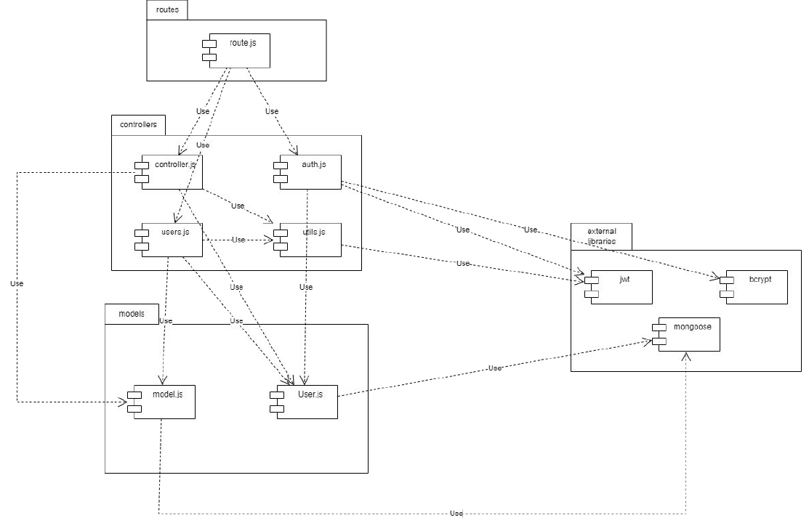
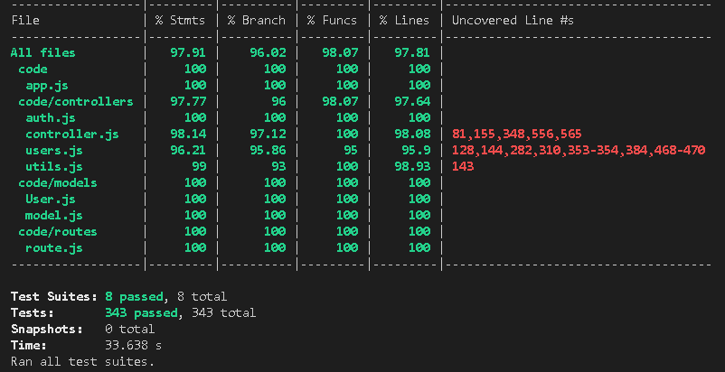

# Test Report

## 

# Contents

- [Dependency graph](#dependency-graph)

- [Integration approach](#integration-approach)

- [Tests](#tests)

- [Coverage](#Coverage)

 

# Dependency graph 

     
# Integration approach

    bottom up approach
    step1: unit auth
    step2: unit controller
    step3: unit users
    step4: unit utils
    step5: unit auth + unit users
    step6: unit auth + unit users + unit controller
    step7: unit auth + unit users + unit controller + unit utils

# Tests

| Test case name | Object(s) tested | Test level | Technique used |
|--|--|--|--|
| **handleDateFilterParams** |
| from filter | date | unit, integration | statement coverage |
| upTo filter | date | unit, integration | statement coverage |
| date filter | date | unit, integration | statement coverage |
| from and upTo filters | date | unit, integration | statement coverage |
| date and upTo filters | date | unit, integration | statement coverage |
| date and from filters | date | unit, integration | statement coverage |
| wrong date - from filters | date | unit, integration | statement coverage |
| wrong date - upTo filter | date | unit, integration | statement coverage |  
| wrong date - date filter | date | unit, integration | statement coverage |  
| **handleAmountFilterParams** |
| min filter | amount parameter | unit, integration | statement coverage |
| max filter | amount parameter | unit, integration | statement coverage |
| max and min filter | amount parameter | unit, integration | statement coverage |
| min is not a number | amount parameter | unit, integration | statement coverage |
| max is not a number | amount parameter | unit, integration | statement coverage |

| Test case name | Object(s) tested | Test level | Technique used |
|--|--|--|--|
| **verifyAuth** |
| no cookie | authentication | unit | statement coverage |
| Simple auth | authentication | unit | statement coverage |
| Simple wrong decoded token on access | authentication | unit | statement coverage |
| Simple wrong decoded token on refresh | authentication | unit | statement coverage |
| Simple wrong corrispondence between token | authentication | unit | statement coverage |
| Admin auth | authentication | unit  | statement coverage |
| Admin auth wrong token | authentication | unit | statement coverage |
| User auth | authentication | unit | statement coverage |
| User auth wrong token | authentication | unit | statement coverage |
| Group auth | authentication | unit | statement coverage | 
| Group auth wrong | authentication | unit | statement coverage |
| Toekn expired then okay User | authentication | unit | statement coverage |
| Token expired then no okay User | authentication | unit | statement coverage |
| Token expired Admin ok | authentication | unit | statement coverage |
| Token expired Admin no ok | authentication | unit | statement coverage |
| Token expired Group ok | authentication | unit  | statement coverage |
| Token expired Simple ok | authentication | unit | statement coverage |
| Token expired Group no ok | authentication | unit | statement coverage |
| 2 Tokens expired | authentication | unit  | statement coverage |
| token expire plus other error | authentication | unit | statement coverage |
| token expire plus other error | authentication | unit | statement coverage |
| Token is missing information (username) | authentication | integration | statement coverage |
| Token is missing information (role) | authentication | integration | statement coverage |
| Token is missing information (email) | authentication | integration | statement coverage |
| Token with different username | authentication | integration | statement coverage |
| Token with different email | authentication | integration | statement coverage |
| Access and refresh token expired | authentication | integration | statement coverage |

| Test case name | Object(s) tested | Test level | Technique used |
|--|--|--|--|
| **registration** |
| correct registration | user | unit, integration | statement coverage |
| username already used | user | unit, integration | statement coverage |
| email already used |  user | unit, integration | statement coverage |
| email in wrong format | user | unit, integration | statement coverage |
| Raise exception |  user | unit | statement coverage |
| **registerAdmin** |
| correct registration | admin | unit, integration | statement coverage |
| username already used | admin | unit, integration | statement coverage |
| email already used |  admin | unit, integration | statement coverage |
| email in wrong format | admin | unit, integration | statement coverage |
| Raise exception |  admin | unit | statement coverage |
| **login** |
| correct login  |  user | unit | statement coverage |
| wrong params (no pwd) |  user | unit, integration | statement coverage |
| email  wrong format |  user | unit, integration | statement coverage |
| user not found | user | unit | statement coverage |
| raise exception | user | unit | statement coverage |
| Correct login regular user | user | integration | statement coverage |
| No mail | user | integration | statement coverage |
| Not registered yet | user | integration | statement coverage |
| **logout** | 
| raise exception | user, admin | unit | statement coverage |
| correct logout | user, admin | unit | statement coverage |
| user not found | user, admin | unit | statement coverage |
| Unauthorized | user, admin | unit  | statement coverage | 
| Correct logout after login | user, admin | unit | statement coverage |

| Test case name | Object(s) tested | Test level | Technique used |
|--|--|--|--|
| **getUsers** |
| should return empty list if there are no users | user, authentication | unit | statement coverage |
| should retrieve list of all users | user, authentication | unit | statement coverage |
| Unauthorized access | user, authentication | unit | statement coverage |
| raise exception | user, authentication | unit | statement coverage |
| should return Unauthorized |  user, authentication | integration | statement coverage |
| should return all users | user, authentication | integration | statement coverage |
| **getUser** |
| admin login | user, authentication | unit | statement coverage |
| no credentials | user, authentication | unit | statement coverage |
| user not found | user, authentication | unit | statement coverage |
| user search his profile | user, authentication | unit, integration | statement coverage |
| raise exception | user, authentication | unit | statement coverage |
| User try to take info of another user | user, authentication |integration | statement coverage |
| Admin takes info of a user | user, authentication | integration | statement coverage |
| **deleteUser** |
| no admin privileges | user, authentication | unit | statement coverage | 
| user not found | user, authentication | unit | statement coverage |
| User successfully deleted and in a group | user, authentication | unit | statement coverage |
| request body email is not present | user, authentication | integration | statement coverage |
| User try to delete another user |  user, authentication | integration | statement coverage |
| Admin delete another user |  user, authentication | integration | statement coverage | 
| Admin try to delete another admin |  user, authentication | integration | statement coverage | 
| Admin delete another user that the only member of a group |  user, authentication | integration | statement coverage |

| Test case name | Object(s) tested | Test level | Technique used |
|--|--|--|--|
| **createGroup** |
| Normal bhavior | user, authentication, group  | unit, integration | statement coverage |
| Group with the same name already exist | user, authentication, group | unit | statement coverage |
| No cookies | user, group | unit | statement coverage |
| Email format not valid | user, authentication, group | unit, integration | statement coverage |
| invalid request | user, group | unit, integration | statement coverage |
| User create a group with only the creator present | user, group | integration | statement coverage |
| User create a group with a wrong name |  user, group | integration | statement coverage |
| Group creator already in a group |  user, group | integration | statement coverage |
| User creates a group with all members already in a group |  user, group | integration | statement coverage |
| **getGroups**|
| admin request | user, authentication, group | unit, integration | statement |
| no admin | user, authentication, group | unit, integration | statement |
| No groups | user, authentication, group | unit | statement |
| raise exception | user, authentication, group | unit | statement |
| Admin get group | group, authentication | integration | statement coverage |
| **getGroup** |
| no cookies| user, authentication, group | unit | statement | 
| user not in the group list | user, authentication, group | unit | statement |
| admin doesn't find a group | user, authentication, group | unit | statement |
| user not find a group | user, authentication, group | unit | statement |
| raise exception | user, authentication, group | unit | statement coverage |
| Admin get group | group, authentication | integration | statement coverage |
| No admin cookie | group, authentication | integration | statement coverage |
| No group found | group, authentication | integration | statement coverage | 
| Group found and user present in members | group, user, authentication | integration  | statement coverage |
| Group found and user not present in members | group, user, authentication | integration | stetement coverage |
| **addToGroup** |
| Group not found | group, authentication | unit | statement coverage |
| admin request with wrong email format | group, authentication | unit | statement coverage |
| user request not authorized  | group, authentication | unit | statement coverage |
| user request group not found | group, authentication | unit | statement coverage |
| user request, all ok | group, authentication | unit | statement coverage |
| Bad request | group, authentication | unit | statement coverage |
| User access with admin path | group, authentication | unit | statement coverage |
| Admin add user to group | group, user, authentication | integration | statement coverage |
| Admin add user to group with some users already in the group | user, group, authentication | integration | statement coverage |
| Admin add user to group with some users already in the group |  user, group, authentication | integration | statement coverage |
| User try to add an user to a group where he is not enrolled |  user, group, authentication | integration | statement coverage |
| User try to add an user to a group where he is enrolled |  user, group, authentication | integration | statement coverage |
| wrong request format, no field emails |  group, authentication | integration | statement coverage | 
| No cookie | group, authentication | integration | coverage statement |
| Group not found | group, authentication | integration | coverage statement| 
| **removeFromGroup** |
| Admin request but group has only one user | user, group, authentication | unit | statement coverage |
| Admin request with valid group and members to remove | user, group, authentication | unit | statement coverage |
| Admin request but wrong email format | user, group, authentication | unit | statement coverage |
| Bad request | group, authentication | unit | statement coverage |
| user request not authorized | user, group, authentication | unit | statement coverage |
| user request with admin path | user, group, authentication | unit | statement coverage |
| user request group not found | user, group, authentication | unit | statement coverage |
| Admin request | user, group, authentication | unit | statement coverage |
| Admin remove user from group of one memeber | user, authentication, group | integration | statement coverage |
| Admin remove user from group |  user, authentication, group | integration | statement coverage |
| User try to remove user from group without being authorized |  authentication, group | integration | statement coverage |
| User try to remove user from group where he is enrolled |  user, authentication, group | integration | statement coverage |
| Bad request |  user, authentication, group | integration | statement coverage |
| Admin try to remove user that not exist from group |  user, authentication, group | integration | statement coverage |
| **deleteGroup** |
| success | group, authentication | unit | statement coverage |
| not admin | group, authentication | unit | statement coverage |
| bad request | group, authentication | unit | statement coverage |
| group not found | group, authentication | unit | statement coverage |
| Admin delete group | group, authentication | integration | statement coverage |
| No admin cookie | group, authentication | integration | statement coverage |
| No group found |  group, authentication | integration | statement coverage |
| req error | group, authentication | integration | statement coverage |

| Test case name | Object(s) tested | Test level | Technique used |
|--|--|--|--|
| **createCategory** | 
| should return the new category | category | unit, integration | statement coverage |
| raise exception | category | unit | statement coverage |
| Unauthorized access | category | unit, integration | statement coverage |
| empty type field | category | unit, integration | statement coverage |
| empty color field| category | unit, integration | statement coverage |
| type already present | category | unit, integration | statement coverage |
| **updateCategory** | 
| Update category | category | unit, integration | statement coverage |
| Admin request to update existing category with transactions | category | unit | statement coverage | 
| Admin request to update existing category without transactions | category | unit | statement coverage |
| Admin request to update non-existing category | category | unit | statement coverage |
| Admin request to update category with missing request body attributes | category | integration | statement coverage |
| Non-admin request to update category | category | unit | statement coverage |
| User unauthorized | category, authentication | integration | statement coverage |
| Category not found | category | integration | statement coverage | 
| Category already present | category | integration | statement coverage |
| **deleteCategory** | 
| Admin request to delete existing categories with transactions | category | unit, integration | statement coverage |
| Admin request to delete non-existing categories | category | unit, integration | statement coverage |
| Admin request to delete more categories than present in the database | category | unit, integration | statement coverage |
| Admin request to delete the only category in the database | category | unit, integration | statement coverage |
| Non-admin request to delete categories | category | unit, integration | statement coverage |
| Invalid request with missing types | category | unit, integration | statement coverage |
| Invalid request with empty type | category | unit, integration | statement coverage |
| User unauthorized | category, authentication | integration | statement coverage |
| Request body wrong |  category | integration | statement coverage |
| Types is empty | category | integration | statement coverage |
| Types include an empty string | category | integration | statement coverage |
| We have 5 category and try to delete 6 category  | category | integration | statement coverage |
| Try to delete all categories |  category | integration | statement coverage |
| Try to delete 2 categories | category | integration | statement coverage |
| **getCategories** | 
| should return empty list if there are no categories | category | unit, intergration | statement coverage |
| should retrieve list of all categories |  category | unit, intergration | statement coverage |  category | unit, intergration | statement coverage |
| Unauthorized access |  category | unit, intergration | statement coverage |
| raise exception |  category | unit, intergration | statement coverage |
| **createTransaction** | transaction | unit, integration | statement coverage |
| should return the new transaction | transaction | unit, integration | statement coverage |
| Unauthorized access | transaction | unit, integration | statement coverage |
| raise exception | transaction | unit | statement coverage |
| empty username field | transaction | unit, integration | statement coverage |
| empty type field | transaction | unit, integration | statement coverage |
| amount field is not a number | transaction | unit, integration | statement coverage |
| route param user not found | transaction | unit, integration | statement coverage |
| req body user not found | transaction | unit, integration | statement coverage |
| req body user and route param user dont match | transaction | unit, integration | statement coverage |
| category not found | transaction | unit, integration | statement coverage |

| Test case name | Object(s) tested | Test level | Technique used |
|--|--|--|--|
| **getAllTransactions** |
| should return empty list if there are no transactions | transaction | unit, integration | statement coverage |
| should retrieve list of all transactions |  transaction | unit, integration | statement coverage |
| Unauthorized access | transaction | unit, integration | statement coverage |
| raise exception | transaction | unit | statement coverage |
| **getTransactionsByUser** | 
| should return transactions for admin route | transaction, user | unit| statement coverage |
| should return transactions for user route with date and amount filters | transaction, user | unit | statement coverage |
| should return 400 error if user does not exist | transaction, user | unit | statement coverage | 
| should return 401 error for unauthorized user |transaction, user | unit | statement coverage |
| User search for another user transactions | user, transaction | integration | statement coverage |
| User search for his transactions |  user, transaction | integration | statement coverage |
| User search for his transactions with date filter |  user, transaction | integration | statement coverage |
| User search for his transactions with amount filter | user, transaction | integration | statement coverage |
| User search for his transactions with amount and date filter | user, transaction | integration | statement coverage |
| Admin search for another user transactions |  user, transaction | integration | statement coverage |
| No cookie |  user, transaction | integration | statement coverage |
| User search for his transactions with amount and date filter second test |  user, transaction | integration | statement coverage |
| **getTransactionsByUserByCategory** | 
| admin route - should return empty list if there are no transactions for that user and category | transaction, user, category | unit, integration | statement coverage |
| admin route - should return list of transactions for that user and category | transaction, user, category | unit, integration | statement coverage | 
| user route - should return empty list if there are no transactions for that user and category |transaction, user, category | unit, integration | statement coverage |
| user route - should return list of transactions for that user and category | transaction, user, category | unit, integration | statement coverage |
| admin route - should return 500 if there is an error | transaction, user, category | unit, integration | statement coverage |
| user route - should return 500 if there is an error | transaction, user, category | unit, integration | statement coverage |
| admin route - should return 401 if user is not authorized | transaction, user, category | unit, integration | statement coverage |
| user route - should return 401 if user is not authorized | transaction, user, category | unit, integration | statement coverage |
| admin route - should return 400 if user does not exist | transaction, user, category | unit, integration | statement coverage |
| user route - should return 400 if user does not exist | transaction, user, category | unit, integration | statement coverage |
| admin route - should return 400 if category does not exist | transaction, user, category | unit, integration | statement coverage |
| user route - should return 400 if category does not exist | transaction, user, category | unit, integration | statement coverage |
| **getTransactionsByGroup** | 
| admin route - should return empty list if there are no group transactions | transaction, group  | unit, integration | statement coverage |
|  admin route - should retrieve list of all group transactions | transaction, group  | unit, integration | statement coverage | 
| user route - should return empty list if there are no group transactions | transaction, group  | unit, integration | statement coverage |
| user route - should retrieve list of all group transactions| transaction, group  | unit, integration | statement coverage |
| admin route - Unauthorized access | transaction, group  | unit, integration | statement coverage |
| user route - Unauthorized access | transaction, group  | unit, integration | statement coverage | 
| admin route - Group not found | transaction, group  | unit, integration | statement coverage |
| user route - Group not found | transaction, group  | unit, integration | statement coverage |
| admin route - raise exception | transaction, group  | unit, integration | statement coverage |
| user route - raise exception | transaction, group  | unit, integration | statement coverage |
| **getTransactionsByGroupByCategory** | 
| admin route - should return the list of transactions for that group and category | transaction, group, category | unit, integration | statement coverage |
| user route - should return the list of transactions for that group and category | transaction, group, category | unit, integration | statement coverage | 
| admin route - should return empty list if there are no group transactions for that category | transaction, group, category | unit, integration | statement coverage |
| user route - should return empty list if there are no group transactions for that category | transaction, group, category | unit, integration | statement coverage |
| admin route - Unauthorized access | transaction, group, category | unit, integration | statement coverage | 
| user route - Unauthorized access | transaction, group, category | unit, integration | statement coverage |
| admin route - Group not found | transaction, group, category | unit, integration | statement coverage |
| user route - Group not found | transaction, group, category | unit, integration | statement coverage |
| admin route - Category not found | transaction, group, category | unit, integration | statement coverage |
| user route - Category not found | transaction, group, category | unit, integration | statement coverage |
| admin route - raise exception | transaction, group, category | unit, integration | statement coverage |
| user route - raise exception | transaction, group, category | unit, integration | statement coverage |

| Test case name | Object(s) tested | Test level | Technique used |
|--|--|--|--|
| **deleteTransaction** |
| User request to delete an existing transaction |  transaction, authentication | unit, integration | statement coverage |
| User request to delete a non-existing transaction |  transaction, authentication | unit, integration | statement coverage | 
| User request to delete a transaction of a different user |  transaction, authentication | unit, integration | statement coverage |
| User request with missing _id |  transaction, authentication | unit, integration | statement coverage |
| Authenticated user request to delete a transaction of another user|  transaction, authentication | unit | statement coverage |
| Invalid user |
| req body not present |
| transaction not found |
| User try to delete a transaction created by another user |
| User try to delete a transaction created by himself | 
| **deleteTransactions** | 
| Admin request to delete existing transactions | transaction, authentication | unit | statement coverage |
| Admin request to delete non-existing transactions | transaction, authentication | unit | statement coverage |
| Non-admin request to delete transactions | transaction, authentication | unit | statement coverage |
| Invalid request with missing _ids | transaction, authentication | unit | statement coverage |
| Invalid request with empty _id | transaction | unit, integration | statement coverage |
| Internal server error | transaction, authentication | unit | statement coverage |
| Not authorized | transaction, authentication | integration | statement coverage |
| Empty _ids | transaction, authentication | integration | statement coverage |
| Invalid single id | transaction, authentication | integration | statement coverage |
| Id not found | transaction, authentication | integration | statement coverage |
| Transaction correctly deleted | transaction, authentication | integration | statement coverage |
| Transaction correctly deleted with Access token expired | transaction, authentication | integration | statement coverage |

# Coverage

## Coverage of FR

<Report in the following table the coverage of  functional requirements (from official requirements) >

### **FR Unit tests**
<!-- Nei test indicare ciascun Test (ciascun test case) -->
| Functional Requirements covered |   Unit Test(s) | 
| ------------------------------- | ----------- | 
| FR11 - register | correct registration |          
|| username already used | 
|| email already used |  
|| email in wrong format |
|| Raise exception |
| FR12  - login | correct login  |
|| wrong params (no pwd) | 
|| email  wrong format |
|| user not found |
|| raise exception |
| FR13 - logout | raise exception |
|| correct logout|
|| user not found |
|| Unauthorized |
| FR14 - registerAdmin | correct registration |
|| username already used |
|| email already used |
|| email in wrong format |
|| Raise exception ||

| Functional Requirements covered |   Unit Test(s)  | 
| ------------------------------- | ----------- | 
| FR15 - getUsers| should return empty list if there are no users |
|| should retrieve list of all users |
|| Unauthorized access |
|| raise exception |
| FR16 - getUser | admin login |
|| no credential |
|| user not found |
|| user search his profile |
|| raise exception |
| FR17 - deleteUser | no admin privileges |
|| user not found | 
|| User successfully deleted and in a group |
| FR21 - createGroup | Normal behavior |
|| Group with the same name already exist | 
|| No cookies |
|| Email format not valid |
|| invalid request |
| FR22 - getGroups | admin request |
|| no admin |
|| no groups |
|| raise exception |
| FR23 - getGroup | no cookies |
|| user not in the group list  |
|| admin doesn't find a group |
|| user not find a group |
|| raise exception |
| FR24 - addToGroup | Group not found |  
|| admin request with wrong email format | 
|| user request not authorized |
|| user request group not found |
|| user request, all ok |
|| Bad request |
|| User access with admin path |
| FR26 - removeFromGroup | Admin request but group has only one user |
|| Admin request with valid group and members to remove |
|| Admin request but wrong email format |
|| Bad request |
|| user request not authorized |
|| user request with admin path |
|| user request group not found |
|| Admin request |
| FR28 - deleteGroup | not admin |
|| bad request |
|| group not found |
|| success |

| Functional Requirements covered |   Unit Test(s)  | 
| ------------------------------- | ----------- | 
| FR31 - createTransaction| should return the new transaction |
|| Unauthorized access |
|| raise exception |
|| empty username field |
|| empty type field |
|| amount field is not a number |
|| route param user not found |
|| req body user not found |
|| req body user and route param user dont match |
|| category not found |
| FR32 - getAllTransactions | should return empty list if there are no transactions |
|| should retrieve list of all transactions |
|| Unauthorized access |
|| raise exception |
| FR33 - getTransactionsByUser  | should return transactions for admin route |
||  should return transactions for user route with date and amount filters |
|| should return 400 error if user does not exist |
|| should return 401 error for unauthorized user |
| FR34 - getTransactionsByUserByCategory| admin route - should return empty list if there are no transactions for that user and category |
|| admin route - should return list of transactions for that user and category |
|| user route - should return empty list if there are no transactions for that user and category |
|| user route - should return list of transactions for that user and category |
|| admin route - should return 500 if there is an error |
|| user route - should return 500 if there is an error |
|| admin route - should return 401 if user is not authorized |
|| user route - should return 401 if user is not authorized |
|| admin route - should return 400 if user does not exist | 
|| user route - should return 400 if user does not exist |
|| admin route - should return 400 if category does not exist |
|| user route - should return 400 if category does not exist |
| FR35 - getTransactionsByGroup | admin route - should return empty list if there are no group transactions |
||  admin route - should retrieve list of all group transactions |
|| user route - should return empty list if there are no group transactions |
|| user route - should retrieve list of all group transactions| 
|| admin route - Unauthorized access |
|| user route - Unauthorized access |
|| admin route - Group not found | 
|| user route - Group not found |
|| admin route - raise exception |
|| user route - raise exception |
| FR36 - getTransactionsByGroupByCategory | admin route - should return the list of transactions for that group and category |
|| user route - should return the list of transactions for that group and category |
|| admin route - should return empty list if there are no group transactions for that category |
|| user route - should return empty list if there are no group transactions for that category |
|| admin route - Unauthorized access |
|| user route - Unauthorized access |
|| admin route - Group not found |
|| user route - Group not found |
|| admin route - Category not found |
|| user route - Category not found |
|| admin route - raise exception |
|| user route - raise exception |
| FR37 - deleteTransaction | User request to delete an existing transaction |
|| User request to delete a non-existing transaction |
|| User request to delete a transaction of a different user |
|| User request with missing _id |
|| Authenticated user request to delete a transaction of another user|
| FR38 - deleteTransactions | Admin request to delete existing transactions |
|| Admin request to delete non-existing transactions |
|| Non-admin request to delete transactions |
|| Invalid request with missing _ids |
|| Invalid request with empty _id |
|| Internal server error |
| FR41 - createCategory | should return the new category |
|| raise exception |
|| Unauthorized access |
|| empty type field |
|| empty color field|
|| type already present |
| FR42 - updateCategory | Update category |
|| Admin request to update existing category with transactions |
|| Admin request to update existing category without transactions |
|| Admin request to update non-existing category |
|| Admin request to update category with missing request body attributes |
|| Non-admin request to update category |
| FR43 - deleteCategory | Admin request to delete existing categories with transactions |
|| Admin request to delete non-existing categories |
|| Admin request to delete more categories than present in the database |
|| Admin request to delete the only category in the database |
|| Non-admin request to delete categories |
|| Invalid request with missing types |
|| Invalid request with empty type |
| FR44 - getCategories | should return empty list if there are no categories |
|| should retrieve list of all categories |
|| Unauthorized access |
|| raise exception |

### **FR Integration tests**

<!-- Nei test indicare ciascun Test (ciascun test case) -->
| Functional Requirements covered |   Integration Test(s) | 
| ------------------------------- | ----------- | 
| FR11 - register | Correct registration |          
|| Wrong registration, mail not valid | 
|| Wrong registration, mail already used |  
|| Wrong registration, username already used  |
| FR12  - login | Correct login regular user  |
|| No pwd | 
|| No mail |
|| Not registered yet |
|| Wrong pwd |
|| Email wrong format |
| FR13 - logout | Correct logout after login |
|| Unauthorized logout |
| FR14 - registerAdmin | Correct registration |
|| Wrong registration, mail not valid |
|| Wrong registration, mail already used |
|| Wrong registration, username already used |

| Functional Requirements covered |   Integration Test(s)  | 
| ------------------------------- | ----------- | 
| FR15 - getUsers| should return Unauthorized |
|| should return a list of all users |
| FR16 - getUser | User try to take info of another user |
|| User takes his info |
|| Admin takes info of a user |
| FR17 - deleteUser | request boby email is not present |
|| User try to delete another user | 
|| User successfully deleted and in a group |
|| Admin delete another user |
|| Admin try to delete another admin |
|| Admin delete another user that the only member of a group |
| FR21 - createGroup | User creates a group |
|| User creates a group with mails has a wrong format | 
|| User create a group with all members not found |
|| User create a group with only the creator present |
|| User create a group with a wrong name|
|| User create a group with a name already taken |
|| Cookie not present |
|| Group creator already in a group |
|| User creates a group with all members already in a group |
| FR22 - getGroups | Admin get all groups |
|| No admin cookie |
| FR23 - getGroup | Admin get group |
|| No admin cookie |
|| No group found |
|| Group found and user present in members |
|| Group found and user not present in members |
| FR24 - addToGroup | Admin add user to group |  
|| Admin add user to group with some users already in the group | 
|| User try to add an user to a group where he is not enrolled |
|| User try to add an user to a group where he is enrolled |
|| wrong request format, no field emails |
|| No cookie |
|| Group not found |
| FR26 - removeFromGroup | Admin remove user from group of one memeber |
|| Admin remove user from group |
|| Admin request but wrong email format |
|| User try to remove user from group without being authorized |
|| User try to remove user from group where he is enrolled |
|| Bad request |
|| Admin try to remove user that not exist from group|
| FR28 - deleteGroup | Admin delete group |
|| No admin cookie |
|| No group found  |
|| req error  |

| Functional Requirements covered |   Integration Test(s)  | 
| ------------------------------- | ----------- | 
| FR31 - createTransaction| should return the new transaction |
|| Unauthorized access |
|| empty username field |
|| empty type field |
|| amount field is not a number |
|| route param user not found |
|| req body user not found |
|| req body user and route param user don't match |
|| category not found |
| FR32 - getAllTransactions | should return empty list if there are no transactions |
|| should retrieve list of all transactions |
|| Unauthorized access |
| FR33 - getTransactionsByUser | User search for another user transactions |
|| User search for his transactions |
|| User search for his transactions with date filter |
|| User search for his transactions with amount filter |
|| User search for his transactions with amount and date filter |
|| Admin search for another user transactions |
|| No cookie |
|| User search for his transactions with amount and date filter second test |
| FR34 - getTransactionsByUserByCategory | admin route - should return empty list if there are no transactions for that user and category |
|| admin route - should return list of transactions for that user and category |
|| user route - should return empty list if there are no transactions for that user and category |
|| user route - should return list of transactions for that user and category |
|| admin route - should return 401 if user is not authorized |
|| user route - should return 401 if user is not authorized |
|| admin route - should return 400 if user does not exist|
|| user route - should return 400 if user does not exist |
|| admin route - should return 400 if category does not exist | 
|| user route - should return 400 if category does not exist|
| FR35 - getTransactionByUserByCategory | admin route - should return empty list if there are no group transactions |
|| admin route - should retrieve list of all group transactions |
|| admin route - Unauthorized access |
|| user route - Unauthorized access |
|| admin route - Group not found |
|| user route - Group not found |
| FR36 - getTransactionsByGroupByCategory | admin route - should return the list of transactions for that group and category |
|| user route - should return the list of transactions for that group and category |
|| admin route - should return empty list if there are no group transactions for that category |
|| user route - should return empty list if there are no group transactions for that category |
|| admin route - Unauthorized access |
|| user route - Unauthorized access |
|| admin route - Group not found |
|| user route - Group not found |
|| admin route - Category not found |
|| user route - Category not found |
| FR37 - deleteTransaction | Invalid user |
|| req body not present |
|| transaction not found |
|| User try to delete a transaction created by another user |
|| User try to delete a transaction created by himself |
| FR38 - deleteTransactions | Not authorized |
|| Empty _ids |
|| Invalid single id |
|| Id not found |
|| Transaction correctly deleted |
|| Transaction correctly deleted with Access token expired |
| FR41 - createCategory | should return the new category |
|| Unauthorized access |
|| empty type field |
|| empty color field|
|| type already present |
| FR42 - updateCategory | User unauthorized |
|| Category not found |
|| Category already present |
|| Update category |
| FR43 - deleteCategory | User unauthorized |
|| Request body wrong |
|| Types is empty |
|| Types include an empty string |
|| We have 5 category and try to delete 6 category |
|| Try to delete all categories |
|| Try to delete 2 categories |
| FR44 - getCategories | should return empty list if there are no categories |
|| should retrieve list of all categories |
|| Unauthorized access |

## Coverage white box
### Test coverage
Report here the screenshot of coverage values obtained with jest-- coverage 

# White Box Unit Tests

### Unit Test cases definition
    
| Unit name | Jest test case |
|--|--|
|auth.js|auth.unit.test.js|
|controller.js|controller.unit.test.js|
|utils.js|utils.unit.test.js|
|users.js|users.unit.test.js|

### Integration Test cases definition
    
| Unit name | Jest test case |
|--|--|
|auth.js|auth.integration.test.js|
|controller.js|controller.integration.test.js|
|utils.js|utils.integration.test.js|
|users.js|users.integration.test.js|

### Code coverage report

<!--
### Loop coverage analysis
-->

